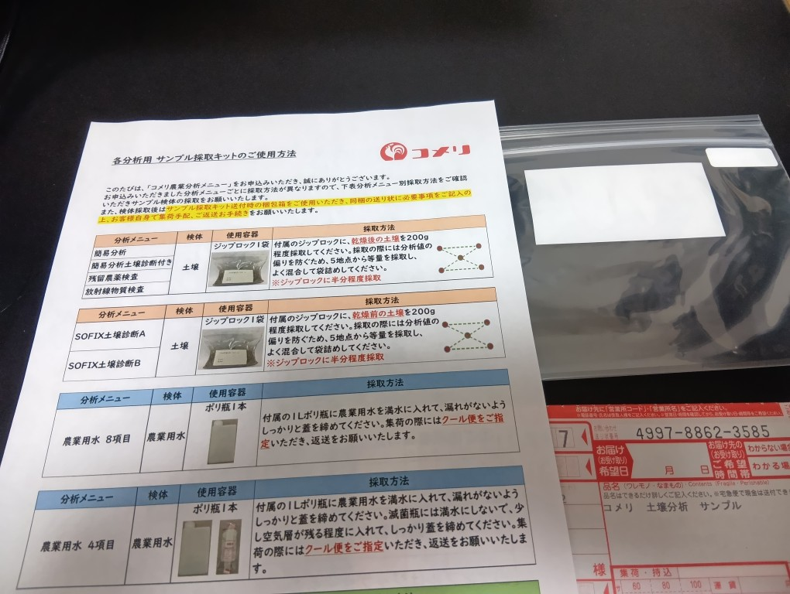
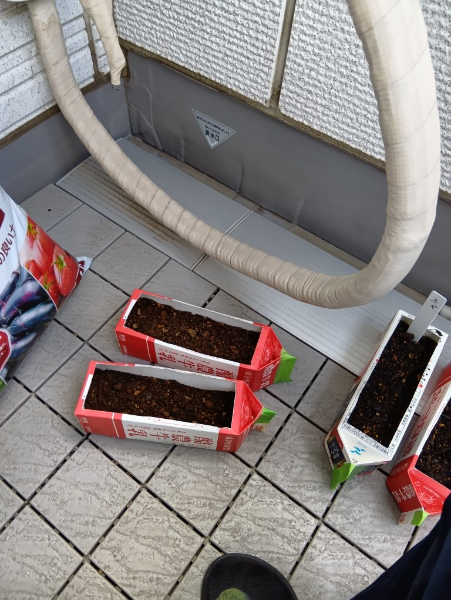
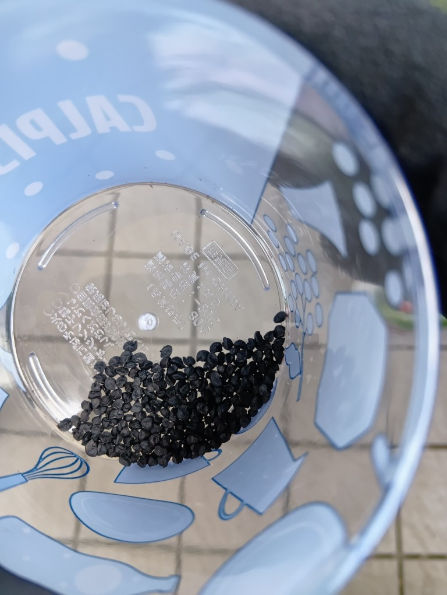
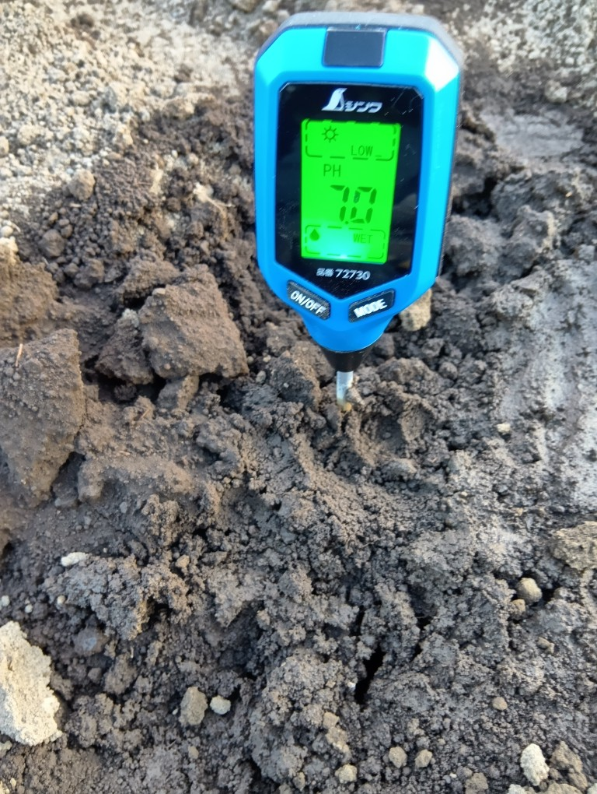
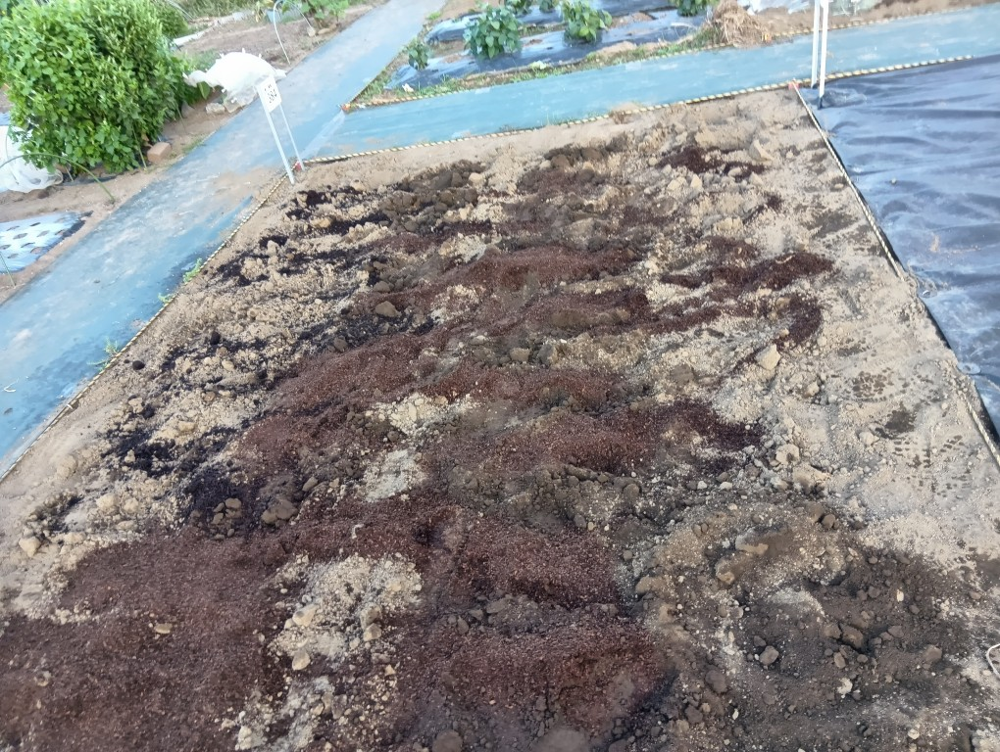
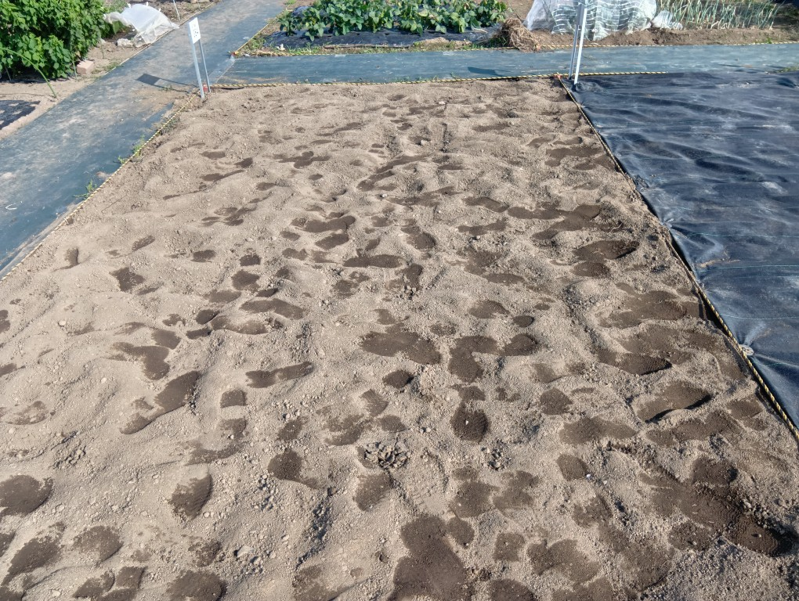
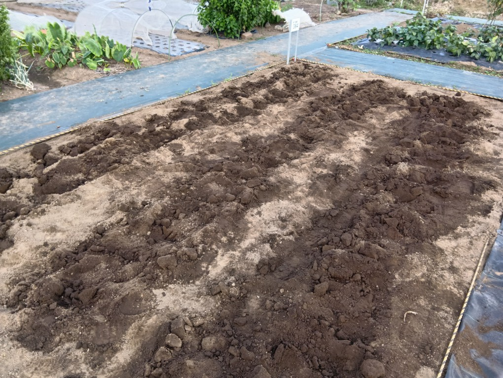

Diary
=============

20251001
---------

コメリで注文した簡易土壌分析キットが届いた。土はあらかじめ採取してあったので、土を詰めてコンビニから発送した。

20250928
---------

もう時期的に遅そうだが、まあうまく育たなくてもいいかという気持ちで玉ねぎとネギのタネを牛乳パックで作ったプランターに植えた。種まき培土はコメリで買った。14Lで400円いかないくらいだった。画像は牛乳パックプランターと玉ねぎのタネ。

|pic5| 　 |pic6|

20250927
---------

ほうれん草を植えてみようと思い、育て方をyoutubeで学んだ。苦土石灰を多く入れろ、とのことだったのだがphが分からなかったのでph測定器で測定した結果、7.0だったり6.5だったり6.0だったりした。思ったよりも酸性ではなく苦土石灰を入れてこれ以上phを上げていいのかよくわからなかったので、とりあえず牛糞堆肥だけを入れることにした。youtubeで調べてみて土壌分析しないと始まらないという結論に達した。コメリの土壌分析はネットで申し込めて、簡易分析なら3980円だったのでこれを利用してみることにした。この日は牛糞堆肥を25L入れて混ぜて終了。

|pic3| 　 |pic4|

20250926
----------

借りた市民農園に行った。耕す前の土はグランドよりも気持ち柔らかいかなと感じる硬さだった。
農機具を借りることができて、スコップを借りた。天地返しをして、この日は終了。背抜き手袋を買って準備していたが忘れてしまって素手で作業していたら手の皮がむけて痛かった。

|pic1| 　 |pic2|

20250925
-----------

市役所に行き、市民農園を借りた。15平方メートル。月500円。農具は借りれる。

20250920
----------

野菜を作ってみたくて市民農園を借りようと思ったので、市民農園を見に行ってみた。