Zhen ICLR'21 Are Neural Rankers still Outperformed by Gradient Boosted Decision Trees?
=========================================================================================

https://openreview.net/forum?id=Ut1vF_q_vC

著者 (全員 Google Research)

- Zhen Qin
- Le Yan
- Honglei Zhuang
- Yi Tay
- Rama Kumar Pasumarthi
- Xuanhui Wang
- Michael Bendersky
- Marc Najork

概要
-------

- 多くの分野でNNモデルが成功しているが、伝統的なLTRの分野ではまだ有効性は認められていない

  - まず最初に、最新のNNモデルがGBDTに大差で劣っていることを示す

- なぜ neraul LTRがGBDTに劣っているかを調査して、弱点を明らかにし、改善方法を考える

- GBDTと同等な性能を発揮するNNモデルを提案する (最新のNNモデルには大勝する)

既存手法のベンチマーク
----------------------

DLCM
^^^^^^^^^

`Learning a Deep Listwise Context Model for Ranking Refinement <https://arxiv.org/abs/1804.05936>`_ (SIGIR'18)

- 何らかのモデルで文書リストを並び替えたものをGRUに突っ込む
- GRUの各文書に対するstateと最終stateを使って、最終的な出力とする

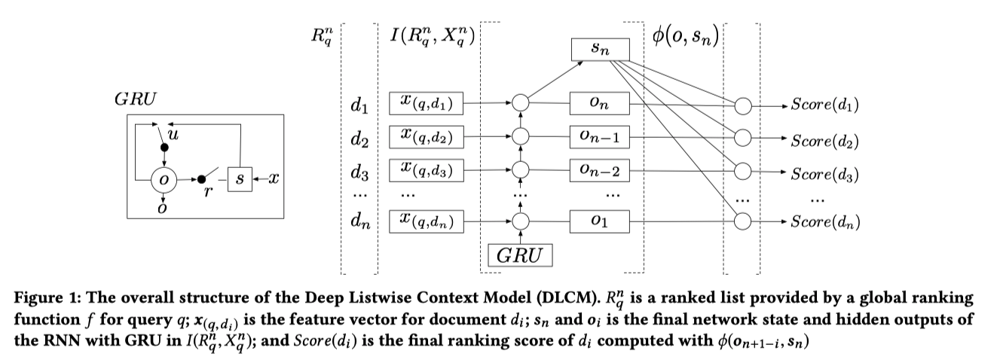

.. math::
  :nowrap:

  \begin{align}
    \phi(o_{n+1-i}, s_n)
    = V_{\phi} \cdot (o_{n+1-i}  \text{tanh}(W_\phi s_n + b_{\phi} ))
  \end{align}

**Attention Rank Loss**

.. math::
  :nowrap:

  \begin{align}
   - &\sum_{i \in [n]} a^y_i \log a^s_i + (1-a^y_i) \log (1-a^s_i) \\
    , & \text{where}~~ a^y_i = \frac{\exp(y_i)}{\sum_{k \in [n]} \exp(y_k)}
    , ~ a^s_i = \frac{\exp(s_i)}{\sum_{k \in [n]} \exp(s_k)}
  \end{align}

- :math:`y_i` : 教師スコア, :math:`s_i` 予測スコア

**設定と比較手法**

- 初期リストはRank-SVM, LambdaMART (ranklib) で作る
- LIDNN : FFNの入力として、文書リストの特徴量をconcatと入れて、出力は文書リストのスコア

  - 入力文書リスト数が40, 各文書の特徴量が700だとすると、入力次元数は28000, 出力次元数は40
  - 文書リスト全体を使える単純なモデルとして用意

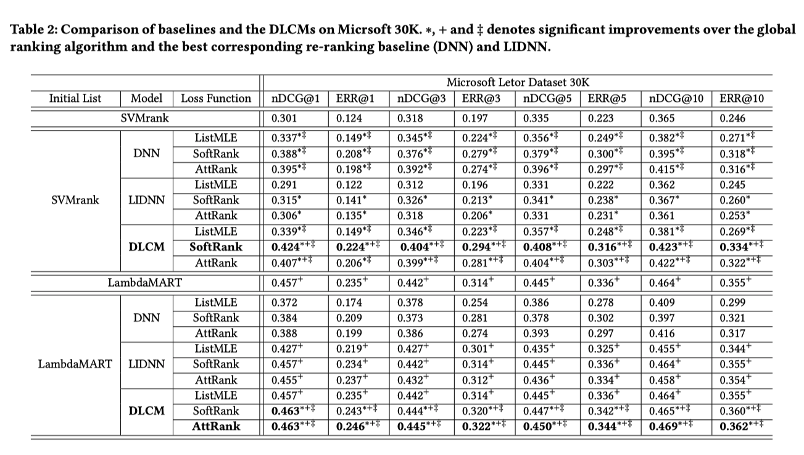

SetRank
^^^^^^^^^^^^^

`SetRank Learning a Permutation Invariant Ranking Model for Information Retrieval <https://arxiv.org/abs/1912.05891>`_ (SIGIR'20)

- Multi-head Self Attention Block (MSAB)使ったやつ

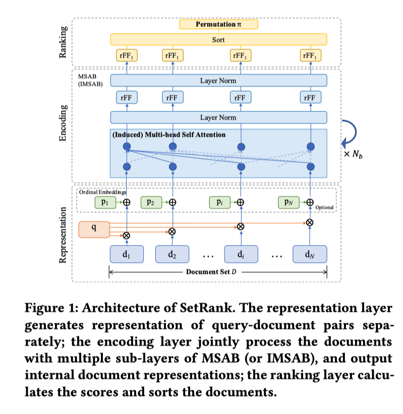

- Ordinal EmbeddingはDLCMみたいに初期のランクが与える場合、その文書のランクを入力にしたembedding (詳しく書いてないが、たぶん普通の学習可能なembedding)

**Induced Multi-head Self attention Block (IMSAB)**

- `Set Transformer A Framework for Attention based Permutation Invariant Neural Networks <https://arxiv.org/abs/1810.00825>`_ (ICML'19) で提案されている

- MASBの問題は入力のセットのサイズに敏感であること
- 学習時と実際に使いときは入力のセットのサイズが違うことが多いので、問題
- その問題に対応するために induces multi-head self atteion blockを導入した

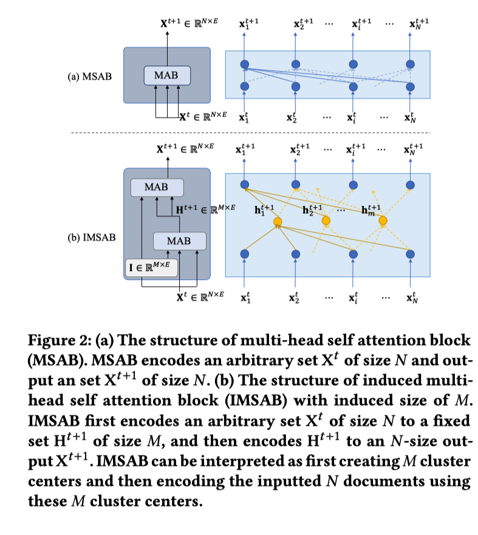

- :math:`I \in \mathbb{RR}^{M \times E}` は学習可能なパラメータ (Mはハイパーパラメータ)

- SetTransformerの論文では、IMSABを導入した理由は計算コストを:math:`O(n^2)` から :math:`O(mn)` に下げるため
- なぜ IMSABが↑の問題の解決策になるのか理解できない

**実験結果**

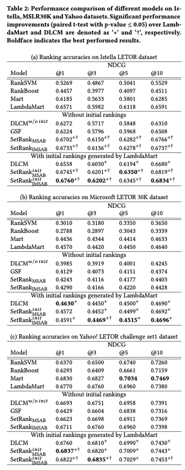

**DASALC論文の実験**

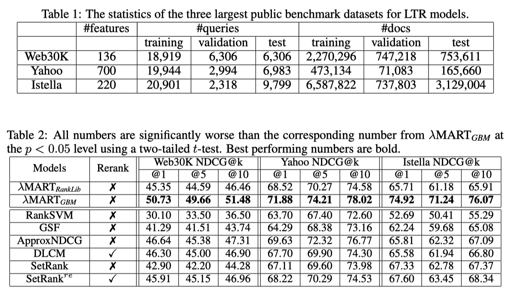

- LightGBM最強
- DLCM, :math:`\text{SetRank}^{re}` は別モデルを使った初期リストが必要だが、DASALC論文ではその初期リストはRanklibのLambdaMARTを使っている

  - DLCM, SetRankの論文ではRanklibが使われているからと書いてあったが、lightgbmのほうがとても強いといっているので、lightgbmにしてほしかった

NNモデルの弱さ
-----------------------

**Feature transformation**

- :doc:`mixture_transformation` によると、NNは特徴量変換にセンシティブ (そんなにセンシティブというほどではないのでは..?)

  - LTR datasetsはアイテムのクリック数などロングテールな分布を持つ多様なスケールの特徴量で構築されている
  - 木構造モデルを用いものは特徴空間を効率的に分割することができて、数値特徴のみをもつデータセットで強い

- 最近の研究ではガウス正規化よりも優れた変換が示されているが、neural LTRのパイオニア的な論文ではその影響は議論されていない

**Network architecture**

- neural LTRの論文ではアーキテクチャに焦点を当てていないものは、大概FC層を重ねたものを使っている

  - FC層は高次のインタラクションを捉えるのに非効率的 (以下の論文を参照している)

    - `Deep Cross Network <https://arxiv.org/pdf/1708.05123.pdf>`_ (AdKDD'17)
    - `Latent Cross <https://research.google/pubs/pub46488/>`_ (WSDM'18)

  - その問題は広告CTR予測(Deep Cross Network), レコメンデーション(Latent Cross)では注目されているが、LTRでは注目されていない

**Data sparsity (特徴量がスパースということではなく、標本数が少ない)**

- nerural LTRの論文のモデルは小さく、パラメータの多いモデルを使っていない

  - おそらくoverfitしてしまうから、パラメータの多いモデルにできない

    - 大規模なデータセットは、他のドメインのNNモデルの多くの最近の成功の重要な要因である
    - publicなLTR データセットは比較的小さい

  - パラメータの多いモデルでoverfitを回避するためのData augmentationは他領域でもよく使われている

    - しかし、LTRデータセットではどうData augmentationは直感的でない (CVにおける画像を回転させるとかと比べると)

提案フレームワーク
-------------------

DASALC (Data Augmented SelfAttentive Latent Cross)

**Feature Transofrmation**

Log1p transformation を使う

.. math::
  :nowrap:

  \begin{align}
    x = \log_e(1+|x|) \odot \text{sign}(x)
  \end{align}

(:math:`\odot` : element-wise multiplication operator)

**Data Augmentation**

Gaussian noiseを加える (Log1pのあとに)

.. math::
  :nowrap:

  \begin{align}
    x = x + \mathcal{N}(0, \sigma^2 I)
  \end{align}

- 特徴量はLog1p変換で正規化されているので、:math:`\sigma` を特徴量ごとに変えないのは合理的だと言っている
- このようなシンプルなData AugmentationはDASALCだからうまくいって、そうでない場合うまくいかない (実験的に後で示す)

**LEVERAGING LISTWISE CONTEXT**

- LTRでは、文書 :\math:`x_i` のリストをNNモデルに活用できる

  - -> LTRのNNアーキテクチャを強くするための重要な鍵
  - -> リスト情報をencodeするために、Multi-head self-attention (MHSA)を使う

- 普通のDNN(FC-ReLU-BNを重ねたもの)の出力とMHSA側の出力をLaten Crossで統合する

.. math::
  :nowrap:

  \begin{align}
    h_i^{\text{cross}} = (1 + a_i) \odot h_{\text{out}}(x_i)
  \end{align}

- :math:`a_i` : MHSA側の出力
- :math:`h_{\text{out}}(x_i)` : 普通のDNN側の出力

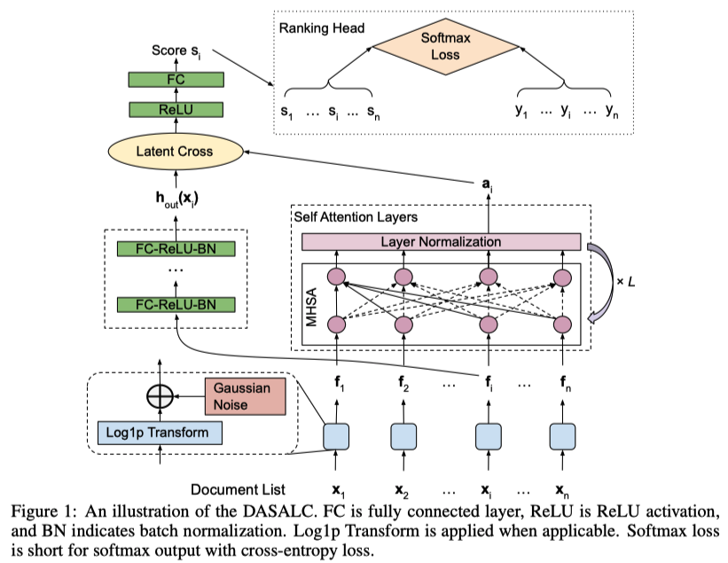

**疑問: リストの順番よって出力が変わってしまうとまずくないですか?**

**Proposition 1**

DASALCの出力スコアは permutationによって変化しない(permutation equivariant), つまり

- :math:`\pi` : (任意の)文書リストの順番並び替え関数
- :math:`x \in \mathbb{R}^{n \times k}` : 文書リスト
- :math:`s_{DASALC}(x)` : DASALCモデルの出力値

として

.. math::
  :nowrap:

  \begin{align}
    s_{DASALC}(\pi(x)) = \pi(s_{DASALC}(x))
  \end{align}

(MHSAがpermutation equivariantなので by https://arxiv.org/abs/1912.05891 (SetRank論文) )

ロス関数
^^^^^^^^^^^

- ロス関数はsoftmax cross entropy loss :math:`l(y, s(x)) = - \sum_{i=1}^n y_i \log_e \frac{\exp(s_i)}{\sum_j \exp(s_j)}`

  - pointwise, pairwise, listwiseいろいろな関数を比較したが、robustで性能が良かったから使っているらしい

ロス関数の比較
"""""""""""""""""""

- SigmoidCrossEntropy:  よく使われているpointwise loss

.. math::
  :nowrap:

  \begin{align}
    l(y, s(x)) = \sum_{i=1}^n -y_i s_i + \log(1+\exp(s_i))
  \end{align}

- `RankNet <https://icml.cc/2015/wp-content/uploads/2015/06/icml_ranking.pdf>`_ (ICML'05): ポピュラーなpairwise loss

.. math::
  :nowrap:

  \begin{align}
    l(y, s(x)) = \sum_{y_i > y_j} \log(1+\exp(s_j - s_i))
  \end{align}

- `LambdaRank <https://papers.nips.cc/paper/2006/hash/af44c4c56f385c43f2529f9b1b018f6a-Abstract.html>`_ (NIPS'07) : :math:`\Delta NDCG(i,j)` (iとjを入れ替えたときのNDCGの変化量の絶対値) で重み付けしたpairwise lossで `LambdaMART <https://www.microsoft.com/en-us/research/uploads/prod/2016/02/MSR-TR-2010-82.pdf>`_ で使われている

.. math::
  :nowrap:

  \begin{align}
    l(y, s(x)) = \sum_{y_i > y_j} \Delta NDCG(i,j) \log_2 (1+\exp(-\alpha (s_i - s_j )))
  \end{align}

- `Softmax <https://www.microsoft.com/en-us/research/wp-content/uploads/2016/02/tr-2007-40.pdf>`_ (ICML'07) : ListNet論文のやつ。ポピュラーなlistwise loss

.. math::
  :nowrap:

  \begin{align}
    l(y, s(x)) = - \sum_{i=1}^n y_i \log_e \cfrac{\exp(s_i)}{\sum_j \exp(s_j)}
  \end{align}

- `ApproxNDCG <https://link.springer.com/article/10.1007/s10791-009-9124-x>`_ (IR'10) : 微分可能にするためにNDCGを近似したもの (listwise loss)

.. math::
  :nowrap:

  \begin{align}
    l(y, s(x)) &= - \frac{1}{DCG(\pi^*, y)} \sum_{i=1}^n \cfrac{2^{y_i} -1 }{\log_2 (1+\pi_s(i))} \\
    , \text{where}~~ \pi_s(i) &= \cfrac{1}{2} + \sum_j \text{sigmoid} \left( \frac{s_j - s_i}{T} \right) ~~ (\text{ T : smooth parameter})
  \end{align}

- `GumbelApproxNDCG <https://dl.acm.org/doi/10.1145/3336191.3371844>`_ (SIGIR'19, WSDM'20) : ApproxNDCGにstochastic treatmentをしたもの.

  - ApproxNDCGのスコアsにgumbel noise :math:`g` を加えたもの (:math:`s_i  + g_i`)
  - :math:`g_i = -\log_e(-log_e U_i), ~~ U_i`  uniformly sampled in :math:`[0, 1]`

- `NeuralSortNDCG <https://openreview.net/forum?id=H1eSS3CcKX>`_ (ICLR'19) NeuralSort trickを使ってNDCGを近似したもの (listwise loss)

.. math::
  :nowrap:

  \begin{align}
    l(y, s(x)) &= - \frac{1}{DCG(\pi^*, y)} \sum_{i, r=1}^n \cfrac{(2^{y_i} -1) P_{ir}^s }{\log_2 (1+r))} \\
    , \text{where}~~ P_{ir}^s &= \text{softmax}\left(\cfrac{(n+1-2i)s_r - \sum_j |s_r -s_j | }{T}\right)
  \end{align}

- GumbelNeuralSortNDCG: NeuralSortNDCGのsにgumbel noise :math:`g` を加えたもの

**実験による制度比較**

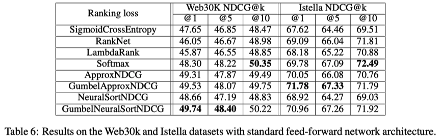

- モデルは standard feed-forward network
- ハイパーパラメータチューニング

  - Optmizerとlearning rate

    - Adam (learning rate :math:`\in \{10^{-4}, 10^{-3}, 10^{-2}\}` )
    - Adagrad (learning rate :math:`\in \{0.01, 0.1, 0.5\}` )

  - smooth paramter :math:`T \in \{0.1, 1, 10\}`
  - で NDCG@5でベストだったものをレポート

得られた知見

- listwiseがpointwise, pairwiseより良かった
- listwiseはどれもcomparableで (本当か?) softmax cross entropyは異なるモデルや異なるデータセットでも一貫して良い性能を発揮していたので、他の実験では使っている
- LambdaRankはNNモデルではうまくいかない

  - 一方 `Bruch et al <https://research.google/pubs/pub48321/>`_  ., (SIGIR'19)では、ツリーモデル + Sotfmatx lossはLambdaMARTより弱いと指摘されている
  - -> ツリーモデルとneural LTRモデルは異なる損失関数で異なる挙動を示す

.. _labelApproxNDCG:

Approx NDCGについて詳しく
"""""""""""""""""""""""""""""""

- DASALC論文では `Revisiting Approximate Metric Optimization in the Age of Deep Neural Networks <https://research.google/pubs/pub48168/>`_  (SIGIR'19) を引用している

  - ApproxNDCG理論的にもいいし、実験的も強いことを確認している論文

    - LambdaMARTが出てきた時期に提案されていたので注目されてなかった
    - その時期はNNを学習するテクニックが発展途上だった

ApproxNDCG再掲

.. math::
  :nowrap:

  \begin{align}
    l(y, s(x)) &= - \frac{1}{DCG(\pi^*, y)} \sum_{i=1}^n \cfrac{2^{y_i} -1 }{\log_2 (1+\pi_s(i))} \\
    , \text{where}~~ \pi_s(i) &= \cfrac{1}{2} + \sum_j \text{sigmoid} \left( \frac{s_j - s_i}{T} \right) ~~ (\text{ T : smooth parameter})
  \end{align}

NDCGとはなんだっか

.. math::
  :nowrap:

  \begin{align}
    \text{NDCG}@k = N_k^{-1} \sum_{j=1}^k g(r_j)d(j)
  \end{align}

- :math:`r_j`: ランキングのj番目の relevance score
- :math:`g(r_j)` : gain function (e.g., :math:`2^{r_j} - 1` )
- :math:`d(j)` : discount function (e.g., :math:`1 / \log_2 (1+j)` ) (下位ほど値が下がっていく)
- :math:`N_k: ~ \sum_{j=1}^k g(r_j)d(j)` が最大になるようにランキングの並び替えたときのそれの値

.. math::
  :nowrap:

  \begin{align}
    \text{NDCG} = N_n^{-1} \sum_{x \in \mathcal{X}} \frac{2^{r(x)} - 1}{\log_2 (1 + \pi(x) )}
  \end{align}

- :math:`\pi(x)` : 文書xがランキングの何位にいるかを返す関数 (position function)

position functionが微分できないので、これを近似していくわけですが、 指示関数を使って以下のように表現できる

(自分よりスコアの高い文書を数えていくだけなんですが)

.. math::
  :nowrap:

  \begin{align}
    \pi(x) = 1 + \sum_{y \in \mathcal{X}, y \neq x } I \{s_{x,y} < 0 \}
  \end{align}

- where :math:`s_{x,y} = s_x - s_y`

指示関数 :math:`I` が微分できないわけですが、ここをおなじみのlogistic functionで近似する

.. math::
  :nowrap:

  \begin{align}
    \hat{\pi}(x) =
    1 + \sum_{y \in \mathcal{X}, y \neq x } \frac{\exp(-\alpha s_{x,y})}{1+\exp(-\alpha s_{x,y})}
  \end{align}

- :math:`\alpha=100` にするとよく近似できているのがわかる

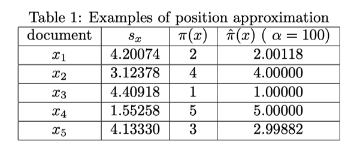

**近似誤差のバウンド**

- :math:`s_{x,y} = 0` (xとyが同じrelevance scoreを持っている)が存在するケースを考えると複雑になってしまうので、以下を仮定する

.. math::
  :nowrap:

  \begin{align}
    \delta :=  \min_{x, y \in \mathcal{X}, x \neq y } |s_{x,y}| > 0
  \end{align}

Theorem 3. 文書集合 :math:`\mathcal{X}, \forall \alpha > 0`  に対して、以下が成り立つ

.. math::
  :nowrap:

  \begin{align}
    | \hat{\pi}(x) - \pi(x) | < \frac{n-1}{\exp(\delta_x \alpha) + 1}
  \end{align}

- where :math:`\delta_x = \min_{y \in \mathcal{X}, y \neq x} |s_{x,y}|`

Corollary 4.  文書集合 :math:`\mathcal{X}, \forall \alpha > 0`  に対して、以下が成り立つ

.. math::
  :nowrap:

  \begin{align}
    \epsilon := \max_{x \in \mathcal{X}} | \hat{\pi}(x) - \pi(x) | < \frac{n-1}{\exp(\delta \alpha) + 1}
  \end{align}

Table 1の例で確認すると、

.. math::
  :nowrap:

  \begin{align}
    0.00118 = \epsilon < \frac{5-1}{\exp(0.06744 \times \alpha) + 1} \approx 0.00471
  \end{align}

Theorem 6. ApproxNDCGの近似誤差は以下のようにバウンドできる

.. math::
  :nowrap:

  \begin{align}
    | \hat{NDCG} - NDCG | < \frac{\epsilon}{2 \ln 2}
  \end{align}

Table 1の例で確認すると :math:`| \hat{NDCG} - NDCG | < \frac{\epsilon}{2 \ln 2} \approx 0.00085`

Remark
^^^^^^^^^^^^

- より柔軟なデータ変換の学習 (:doc:`mixture_transformation`) や `Autoaugment <https://openaccess.thecvf.com/content_CVPR_2019/papers/Cubuk_AutoAugment_Learning_Augmentation_Strategies_From_Data_CVPR_2019_paper.pdf>`_ (最適なdata augmentationを探索して見つける) を使わなかった理由

  - NNモデルがツリーモデルに劣る原因を特定することが目的なので、意図的にシンプル or ポピュラーな手法を使っている (?)

実験
--------

ハイパーパラメータチューニング: valid data使ってチューニングする

- LambdaMARTGBM (grid search)

  - the number of trees :math:`\in \{300, 500, 1000\}`
  - number of leaves :math:`\in \{200, 500, 1000\}`
  - learning rate :math:`\in \{0.01, 0.05, 0.1, 0.5\}`

- DASALC

  - hidden layer size :math:`\in \{256, 512, 1024, 2048, 3072, 4096 \}`

    - 既存研究との顕著な違いは、Data augmentationをする場合4096のような大きなモデルのほうが上手くいく

  - the number of layers :math:`\in \{3, 4, 5, 6\}`
  - data augmentation noise :math:`\in [0, 0.5]` using binary search with step 0.1
  - the number of attention layers :math:`\in \{3, 4, 5, 6\}`
  - the number of attention heads :math:`\in \{2, 3, 4, 5\}`

**Main Results**

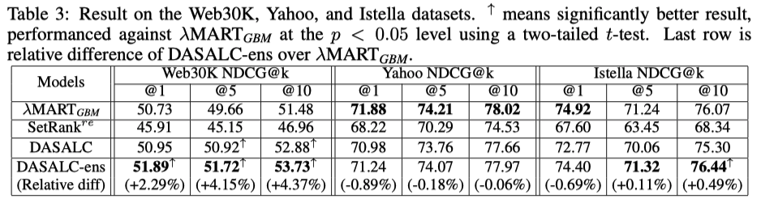

- DASALCはLambdaMARTGBM (lightgbm) と comparable or better
- DASALC-ens (学習時のrandomnessを使った3-5 modelsの平均をとったもの) は有意に LambdaMARTGBMより強い
- Yahooデータセットでの成績は悪いが、これはYahooデータセットが最初から正規化された状態で公開されていて、その正則化はNNにとって理想的ではない可能性がある (ので、生の状態で公開すべきだ)

**LambdaMARTGBMもensembleすると**

- NNモデルは学習時のrandomnessによって、単純なensembleでも意味があったが
- LambdaMARTは毎回似たような結果になってしまって、単純なensembleでは意味がない
- -> 異なるtree数, leaf数, 学習率でモデルを作ってensembleしている

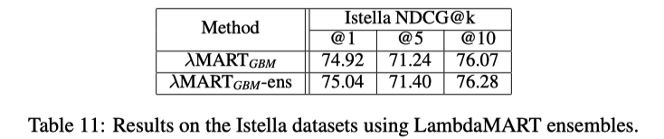

- LambdaMARTのensembleはNNのそれよりも改善が小さい
- NNのアンサンブルはより強い確率的な性質をもっているので、ensembleがより効果的だったではと主張している

**Ablation study**

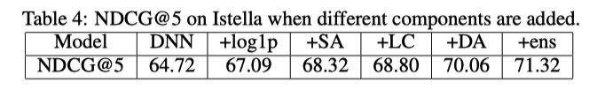

- 左から右に向かって累積的にコンポーネントを追加
- 全部突っ込んだやつが強い

.. image:: ../img/ltr/ltr_dasalc_t7.png
  :scale: 80%
  :align: center

- Listwise contextを使ったコンポーネントを入れたとき

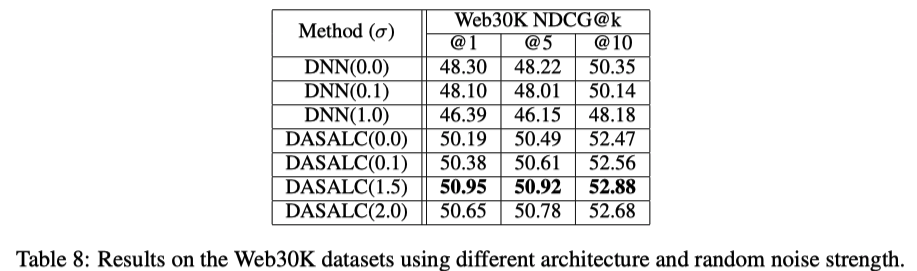

- 普通のDNNだとDeta augmentationの効果がないが、DASALCでは意味がある

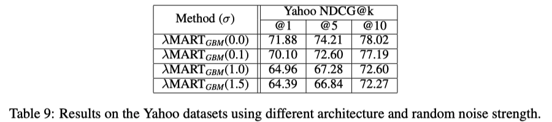

- LambdaMARTにData augmentationすると、ひどい結果になる

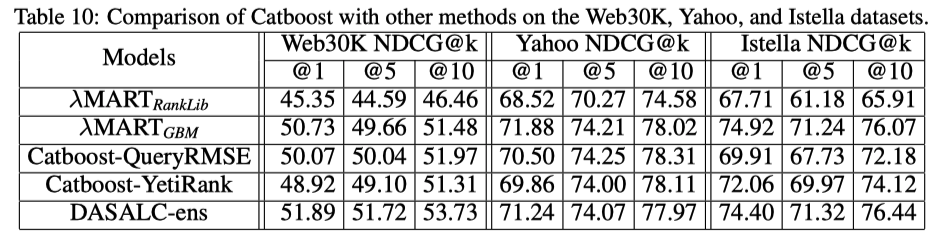

- 他のLambdaMARTの実装(RankLib),CatBoostと比較した結果
- 普通にlightgbmが強い

