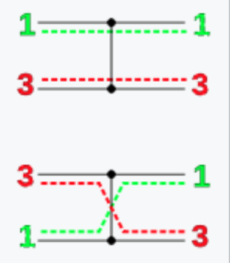
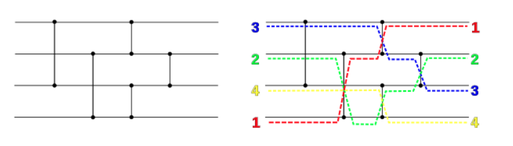
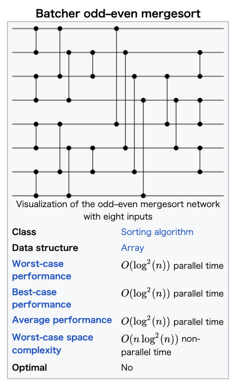
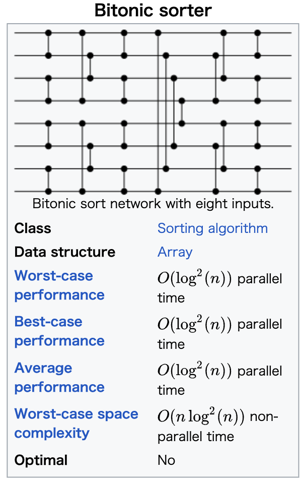
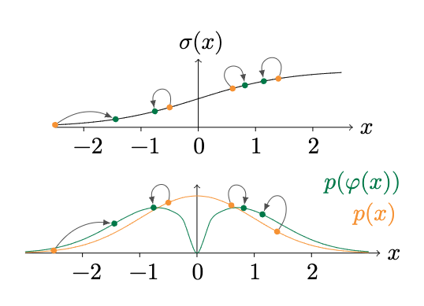
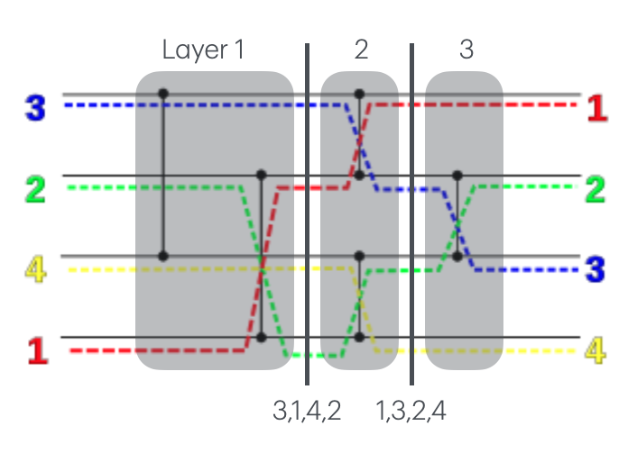

Petersen ICML'21 Differentiable Sorting Networks for Scalable Sorting and Ranking Supervision
====================================================================================================

https://arxiv.org/abs/2105.04019

著者 

- Felix Petersen (University of Konstanz)
- Christian Borgelt (University of Salzburg)
- Hilde Kuehne (University of Frankfurt, MIT-IBM Watson AI)
- Oliver Deussen (University of Konstanz)

概要
-------

- sorting networkはワイヤーとコンパレーターで構成され(どの要素とどの要素の大小比較をしてswapするかを指定する)、それどおりに実行するとsortされる。
- コンパレーターはmin, maxなので微分できないが、それをsigmoidを使って代替することで微分可能にする。

前置き
----------------------

**sorting network**

https://en.wikipedia.org/wiki/Sorting_network

- 横の棒がワイヤーで左から右に値を伝搬する
- ●と縦の棒がコンパレーターで繋がれたところに流れてきた値を比較して、上の値>=下の値ならそのまま、そうでなければスワップする

  - つまり 上の値を :math:`x` , 下の値を :math:`y` としてコンパレーター通した上と下の値はそれぞれ :math:`\min(x, y), \max(x, y)` になる

- この論文で出てくる odd-even sort, bitonic sort は深さが :math:`\mathcal{O}(\log^2 n)` なのでサイズは :math:`\mathcal{O}(n \log^2 n)` 

  - GPUとかで並列実行できれば早い
  - https://en.wikipedia.org/wiki/Batcher_odd%E2%80%93even_mergesort
  - https://en.wikipedia.org/wiki/Bitonic_sorter

- AKS sortは深さが :math:`\mathcal{O}(\log n)` だが、定数部分が大きくて使い物にならないらしい

.. _labelDiffSortNet:

Differentiable Sorting Networks
-----------------------------------

minとmaxを以下のように緩和する

.. math::
  :nowrap:

  \begin{align}
    \text{softmin}(a, b) &:=  a f(b-a) + b (a-b) \\
   \text{softmax}(a, b) &:=  a f(a-b) + b (b-a)
  \end{align}

この論文では :math:`f` はsigmoid関数 ( :math:`f(x) = 1 / (1+\exp(-sx))` ) としている。

:math:`s` は steepness hyperparameterで :math:`s\rightarrow \infty` にするとmin, maxになる。

.. include:: softminmax_demo.ipynb
   :parser: myst_nb.docutils_

|

Activation Replacement Trick
^^^^^^^^^^^^^^^^^^^^^^^^^^^^^^^^^^^^^^^^

2つの問題があるので、値をいじる。

- :math:`|a-b|` が0に近いと勾配が大きくなりすぎて、大きく動きすぎてしまう。
- 逆に :math:`|a-b|` が大きすぎると勾配が消失する。

なので、:math:`\varphi(x) = x / (|x|^\lambda + \epsilon), ~~ (\lambda \in [0, 1])` を :math:`f` の前に挟んで、 正の値は+1, 負の値は-1に近づけるようにする

|

Differentiable Permutation Matrices
^^^^^^^^^^^^^^^^^^^^^^^^^^^^^^^^^^^^^^^^

- 各レイヤーのpermutation matrixは、まず単位行列で初期化し、指定要素の値を次のようにする

.. math::
  :nowrap:

  \begin{align}
    P_{l, ii} = P_{l, jj} &=  f(\varphi(a_j - a_i)) \\
    P_{l, ij} = P_{l, ji} &=  1 - f(\varphi(a_j - a_i)) 
  \end{align}

- relaxed permutation matrixは以下のようになる

.. math:: P = P_n \cdot \ldots \cdot P_2 \cdot P_1

|

sorting networkのwikipediaにある4入力のnetworkで確認してみる。

.. include:: sortnetpm_demo.ipynb
   :parser: myst_nb.docutils_

|

著者によるpytorch実装　
^^^^^^^^^^^^^^^^^^^^^^

https://github.com/Felix-Petersen/diffsort

.. include:: diffsortnet_demo.ipynb
   :parser: myst_nb.docutils_
