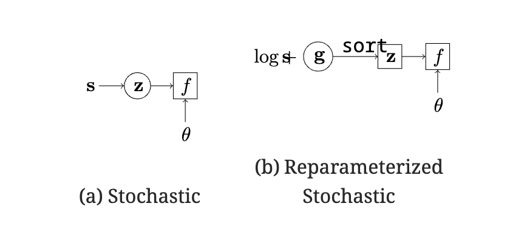

Grover ICLR'19 Stochastic Optimization of Sorting Networks via Continuous Relaxations
=========================================================================================

https://openreview.net/forum?id=H1eSS3CcKX

著者 

- Aditya Grover (Computer Science Department Stanford University)
- Eric Wang (Computer Science Department Stanford University)
- Aaron Zweig (Computer Science Department Stanford University)
- Stefano Ermon (Computer Science Department Stanford University)

概要
-------

- sortをargmaxを用いて記述 → argmaxをsoftmaxで代替して微分可能にする
- 順列の確率がPlackett-Luce分布に従うとした設定のversionも提案  

前置き
----------------------

**Permutation matrixの定義**

まずPermutation matrixを導入します。

- :math:`\mathbf{z} = [z_1, \ldots, z_n]^\top` を長さnのユニークインデックス :math:`\{1, 2, \ldots, n\}` のリストとする (zの取りうる集合を :math:`\mathcal{Z}_n` とする)
- そして　:math:`\mathbf{z}` のpermutation matrix :math:`P_{\mathbf{z}} \in \{0, 1\}^{n \times n}` を以下のように定義する  (:math:`{P_{\mathbf{z}} [i, j]}` は :math:`(i, j)成分` )

.. math::
  :nowrap:

  \begin{align}
    P_{\mathbf{z}}[i, j] := \left\{
    \begin{array}{ll}
    1 & j = z_i \\
    0 & \text{otherwise}.
    \end{array}
    \right.
  \end{align}

|

具体例

- :math:`\mathbf{z} = [1, 3, 4, 2]^\top` とすると :math:`\mathbf{z}` のPermutation Maxtrixは以下になる。

.. math::
  :nowrap:

  \begin{align}
  P_{\mathbf{z}} = 
  \begin{pmatrix}
      1 & 0 & 0 & 0 \\
      0 & 0 & 1 & 0 \\
      0 & 0 & 0 & 1 \\
      0 & 1 & 0 & 0
  \end{pmatrix}
  \end{align}

|

**sort関数の定義**

そして、:math:`\mathbf{s} = [s_1, \ldots, s_n]^\top` を長さ :math:`n` の実数のベクトル、 :math:`[i]` を :math:`\mathbf{s}` の中で :math:`i` 番目に大きい値のindexとして、 sort関数 :math:`\mathbb{R}^n \to \mathcal{Z}_n` を次のように定義します。

.. math::
  :nowrap:

  \begin{align}
    \text{sort}(\mathbf{s}) := [[1], [2], \ldots, [n]]
  \end{align}

そうすると ベクトル :math:`\mathbf{s}` を(降順に)ソートしたベクトルは :math:`P_{\text{sort}(\mathbf{s})} \mathbf{s}` と書けるようになる。

|

具体例

- :math:`\mathbf{s} = [9, 1, 5, 3]^\top` とすると
- 1番大きい9のindexは1, 2番目に大きい5のindexは3、・・・なので :math:`\text{sort}(\mathbf{s}) = [1, 3, 4, 2]^\top` になる
- そして、:math:`\text{sort}(\mathbf{s})` のPermutation matrixは定義より以下となる

.. math::
  :nowrap:

  \begin{align}
  P_{\text{sort}(\mathbf{s})} = 
  \begin{pmatrix}
      1 & 0 & 0 & 0 \\
      0 & 0 & 1 & 0 \\
      0 & 0 & 0 & 1 \\
      0 & 1 & 0 & 0
  \end{pmatrix}
  \end{align}

- そして :math:`P_{\text{sort}(\mathbf{s})} \mathbf{s} = [9, 5, 3, 1]` となるので、ちゃんとソートされている。

|

**Corollary 3 (sortを数学的に記述する)**

- :math:`\mathbf{s}` の要素間の差の行列を :math:`A_{\mathbf{s}}` とする (つまり :math:`A_{\mathbf{s}}[i,j] := |s_i - s_j |`)
- すると、:math:`\text{sort}(\mathbf{s})` のPermutation matrix :math:`P_{\text{sort}(\mathbf{s})}` は以下になる

.. math:: \begin{align}
    P_{\text{sort}(\mathbf{s})} [i, j] = \left\{
    \begin{array}{ll}
    1 & j = \arg \max [(n+1-2i) \mathbf{s} -  A_{\mathbf{s}} \mathbb{1} ]\\
    0 & \text{otherwise}.
    \end{array}
    \right.
  \end{align}
  :label: ns4

- (:math:`\mathbb{1}` は要素がすべて1のcolumn vector)

|

証明: :ref:`labelProofCoro3`

|

具体例

- :math:`\mathbf{s} = [9, 1, 5, 3]^\top` とすると :math:`A_{\mathbf{s}}` は以下になる

.. math::
  :nowrap:

  \begin{align}
  A_{\mathbf{s}} = 
  \begin{pmatrix}
      0 & 8 & 4 & 6 \\
      8 & 0 & 4 & 2 \\
      4 & 4 & 0 & 2 \\
      6 & 2 & 2 & 0
  \end{pmatrix}
  \end{align}

- :math:`i = 1` のとき、以下なので :math:`\arg \max [(n+1-2i) \mathbf{s} -  A_{\mathbf{s}} \mathbb{1} ] = \arg \max[9, -11, 5, -1] = 1`

.. math:: (n+1-2i) \mathbf{s} -  A_{\mathbf{s}} \mathbb{1} = 3s -  A_{\mathbf{s}} \mathbb{1} = [27, 3, 15, 9] - [18, 14, 10, 10] = [9, -11, 5, -1]

- :math:`i = 2` のとき、以下なので :math:`\arg \max [(n+1-2i) \mathbf{s} -  A_{\mathbf{s}} \mathbb{1} ] =\arg \max [-9, -13, -5, -9] = 3`

.. math:: (n+1-2i) \mathbf{s} -  A_{\mathbf{s}} \mathbb{1} = s -  A_{\mathbf{s}} \mathbb{1} = [9, 1, 5, 3] - [18, 14, 10, 10] = [-9, -13, -5, -9]

- :math:`i = 3` のとき、以下なので :math:`\arg \max [(n+1-2i) \mathbf{s} -  A_{\mathbf{s}} \mathbb{1} ] = \arg \max  [-27, -15, -15, -13] = 4`

.. math:: (n+1-2i) \mathbf{s} -  A_{\mathbf{s}} \mathbb{1} = -s -  A_{\mathbf{s}} \mathbb{1} = [-9, -1, -5, -3] - [18, 14, 10, 10] = [-27, -15, -15, -13]

- :math:`i = 4` のとき、以下なので :math:`\arg \max [(n+1-2i) \mathbf{s} -  A_{\mathbf{s}} \mathbb{1} ] = \arg \max [-45, -17, -25, -19] = 2`

.. math:: (n+1-2i) \mathbf{s} -  A_{\mathbf{s}} \mathbb{1} = -3s -  A_{\mathbf{s}} \mathbb{1} = [-27, -3, -15, -9] - [18, 14, 10, 10] = [-45, -17, -25, -19]

- :math:`\text{sort}(\mathbf{s}) = [1, 3, 4, 2]^\top` なのであっている。

提案法: NeuralSort
----------------------

モチベーション

次のようなsortを含む目的関数をgradient-based methodで最適化することが目標 (:math:`\theta` がモデルパラメータで :math:`\mathbf{s}` が :math:`\theta` に依存)

.. math:: L(\theta, \mathbf{s}) = f(P_{\mathbf{z}}; \theta), ~~~ \text{where} ~~ \mathbf{z} = \text{sort}(\mathbf{s}).

提案法

argmaxは微分できないので、softmaxで置換して、sortのPermutation matrixを以下のようにrelaxationする。 (:math:`\tau` は温度パラメータ)

.. math:: \hat{P}_{\text{sort}(\mathbf{s})} [i, :] (\tau) = \text{softmax} [ ((n+1-2i) \mathbf{s} -  A_{\mathbf{s}} \mathbb{1}) / \tau ]
  :label: ns5

|

tensorflowで実装すると次のような感じ(batch版)

.. include:: neuralsort_demo.ipynb
   :parser: myst_nb.docutils_

|

**Theorem 4**

- Limiting behavior: :math:`\mathbf{s}` の各要素が :math:`\mathbb{R}` のルベーグ測度に対して絶対連続な分布から独立に引かれていると仮定すると、以下が成り立つ

.. math:: \lim_{\tau \rightarrow 0^+} \hat{P}_{\text{sort}(\mathbf{s})} [i, :] (\tau) = {P}_{\text{sort}(\mathbf{s})} [i, :] ~~~ \forall i \in \{1,2,\ldots, n\}.
  :label: ns6

- Unimodality: :math:`\forall \tau > 0` において :math:`\hat{P}_{\text{sort}(\mathbf{s})}` は unimodal row stochastic matrixである。さらに、 :math:`\hat{P}_{\text{sort}(\mathbf{s})}` の各行にargmaxを取ったベクトルは :math:`\text{sort}(\mathbf{s})` に一致する。

|

**Limiting behaviorについて**

- :math:`\text{hardmax}(\mathbf{s})` を :math:`i := \arg \max(\mathbf{s})`  としてindex iだけが1で他のindexが0のベクトルを返す関数だとする
- :math:`{P}_{\text{sort}(\mathbf{s})} [i, :] = \text{hardmax}((n+1-2i) \mathbf{s} -  A_{\mathbf{s}} \mathbb{1})` とかける
- で :math:`\text{hardmax}(\mathbf{s}) = \arg \max_{\mathbf{x} \in \Delta^n } \langle \mathbf{x},\mathbf{s} \rangle` とも書ける
-  一方softmaxは次のように書ける (ラグランジュの未定乗数法を使った :ref:`labelProofSoftmax`)

.. math:: \text{softmax}(\mathbf{s}/\tau) = \arg \max_{\mathbf{x} \in \Delta^n } \left[\langle \mathbf{x},\mathbf{s} \rangle - \tau \sum_{i=1}^n x_i \log x_i \right]

- なので :math:`\lim_{\tau \rightarrow 0^+} \text{softmax}(\mathbf{s}/\tau) = \arg \max_{\mathbf{x} \in \Delta^n } \langle \mathbf{x},\mathbf{s} \rangle = \text{hardmax}(\mathbf{s})` なので
- :math:`\lim_{\tau \rightarrow 0^+} \hat{P}_{\text{sort}(\mathbf{s})} [i, :] (\tau) = {P}_{\text{sort}(\mathbf{s})} [i, :] ~~~ \forall i \in \{1,2,\ldots, n\}`

|

**Unimodalityについて**

まず定義します。

Definition 1 (Unimodal Row Stochastic Matrices): 以下の3つを満たす行列のこと

1. Non-negativity: :math:`U[i,j] \geq 0 ~~~ \forall i, j \in \{1,2,\ldots, n\}.`
2. Row Affinity: :math:`\sum_{j=1}^n U[i,j] = 1 ~~~ \forall i, j \in \{1,2,\ldots, n\}.`
3. Argmax Permutation: :math:`u_i = \arg \max_j U[i, j]` とすると :math:`\mathbf{u} \in \mathcal{Z}_n` であること (つまり :math:`\mathbf{u}` がvalid permutationであること)

証明

- Non-negativity, Row Affinity はsoftmaxの定義より成り立つ。
- Argmax Permutationは以下がなりたち、 :math:`\mathbf{u} = \text{sort}(\mathbf{s})` なので成り立つ。

.. math::
  :nowrap:

  \begin{align}
    u_i &= \arg \max [\text{softmax} ((n+1-2i) \mathbf{s} -  A_{\mathbf{s}} \mathbb{1}) ] \\
    &= \arg \max [ ((n+1-2i) \mathbf{s} -  A_{\mathbf{s}} \mathbb{1})  ] ~~~~ (\text{softmaxのmonotonicityより}) \\
    &= [i] ~~~~~~~~~~~~~~~~~~~~~~~~~~~~~~~~~~~~~~~~~~~~~~~~~~~~~~~~~~~~ (\text{Corollary3より})
  \end{align}

|

Unimodalityがあるとなにが嬉しいのか?

- 特に論文中に説明はなかったが、:math:`P_{\text{sort}(\mathbf{s})}` が持っている性質なので :math:`\hat{P}_{\text{sort}(\mathbf{s})}` も同じ性質を持っているからいいよねって感じだと思いました

(疑問)

- 実践的にはsoftmaxよりsoftargmaxのほうがいいんじゃないかと思ったが、どうなのだろうか
- DCGに適用した場合、ApproxNDCG (:ref:`labelApproxNDCG`) と結果的にはあんまりかわらないんじゃないかという気がしてきた

Stochastic Optimization over Permutations
-----------------------------------------------

今までは

.. math:: L(\theta, \mathbf{s}) = f(P_{\mathbf{z}}; \theta)

今度は以下を考える　(:math:`q(\cdot)` は :math:`\mathcal{Z}_n` の要素上の分布)

.. math:: L(\theta, \mathbf{s}) = \mathop{\mathbb{E}}_{q(z|s)} [f(P_{\mathbf{z}}; \theta)]
   :label: ns_eq7

- MCMCで :math:`\theta` に関する勾配の不偏推定量は得られるが、sampling distributionが :math:`\mathbf{s}` に依存するため、:math:`\mathbf{s}` に関する勾配の推定量は直接求められない。
-  REINFORCE gradient estimator (Glynn, 1990; Williams, 1992; Fu, 2006) は :math:`\nabla_s q(\mathbf{z}|\mathbf{s}) = q(\mathbf{z}|\mathbf{s}) \nabla_s \log q(\mathbf{z}|\mathbf{s})` を使って、 MC gradient estimationは

.. math:: \nabla_s L(\theta, \mathbf{s}) = \mathop{\mathbb{E}}_{q(z|s)} [f(P_{\mathbf{z}}; \theta) \nabla_s \log q(\mathbf{z}|\mathbf{s})] + \mathop{\mathbb{E}}_{q(z|s)} [\nabla_s f(P_{\mathbf{z}}; \theta)]

- だが、REINFORCE gradient estimator は High Varianceに苦しんでいる (Schulman et al., 2015; Glasserman, 2013).

|

reparameterization trickを使うと、 :math:`\mathbf{g}` をgumbel noiseとして 式 :eq:`ns_eq7` は以下になる

.. math:: L(\theta, \mathbf{s}) = \mathop{\mathbb{E}}_{\mathbf{g}} [f(P_{\text{sort}(\log \mathbf{s} + \mathbf{g})}; \theta)]

となり、argmaxをsoftmaxで置換して緩和したsortにして、微分したものは

.. math:: \nabla_s \hat{L} (\theta, \mathbf{s}) = \mathop{\mathbb{E}}_{\mathbf{g}} [ \nabla_s f(\hat{P}_{\text{sort}(\log \mathbf{s} + \mathbf{g})}; \theta)]

これは、期待値がsに依存しない分布に関するものであるため、モンテカルロ法で効率的に推定できる。

(実験をみると Stochasticにしても性能が上がるわけではない)

.. _labelProofCoro3:

Proof of Corollary 3
------------------------

まず Lemma 2 [Lemma 1 in Ogryczak & Tamir (2003)] 

.. math:: \sum_{i}^k s_{[i]} = \min_{\lambda \in \{ s_1, \ldots, s_n \}} \lambda k + \sum_{i=1}^n \max(s_i - \lambda, 0).
  :label: ns3

(書きかけ)

.. _labelProofSoftmax:

softmaxの変形の証明
--------------------

.. math:: \text{softmax}(\mathbf{s}/\tau) = \arg \max_{\mathbf{x} \in \Delta^n } \left[\langle \mathbf{x},\mathbf{s} \rangle - \tau \sum_{i=1}^n x_i \log x_i \right]

ラグランジュの未定乗数法を使うと、ラグランジュ関数は

.. math:: \mathcal{L}(\mathbf{x}, \mu, \mathbf{\lambda}) = \langle \mathbf{x},\mathbf{s} \rangle - \tau \sum_{i=1}^n x_i \log x_i + \mu \left(\sum_{i=1}^n x_i - 1 \right) - \sum_{i=1}^n \lambda_i x_i.

(第三項は足して1の制約から、第四項はすべての要素が非負の制約から)

スレーター制約を満たすのでKKT条件が最適性の必要十分条件になって、KKT条件は以下。

.. math::
  :nowrap:

  \begin{align}
    \cfrac{\partial \mathcal{L}}{\partial x_i} &= s_i - \tau \log x_i - \tau + \mu - \lambda_i = 0, ~~~ \forall i \\
    \mu \left( \sum_{i} x_i -1 \right) &= 0, \\
    \lambda_i x_i &= 0, \\
    x_i &\ge 0,
  \end{align}

1つ目の条件から

.. math:: x_i = \exp \left(\frac{s_i - \tau + \mu - \lambda_i }{\tau} \right)
  :label: pf_s1

となるので :math:`x_i > 0` になり、また :math:`\lambda_i x_i = 0` なので :math:`\lambda_i = 0` になる。

2つ目の条件と式 :eq:`pf_s1` から

.. math:: \begin{aligned}
    & \sum_{i} x_i  = 1 
    \Leftrightarrow  \sum_{i} \exp \left(\frac{s_i - \tau + \mu }{\tau} \right) = 1 \notag \\
    \Leftrightarrow  & \sum_{i} \exp \left(\frac{s_i}{\tau} \right) \exp(-1)  \exp \left(\frac{ \mu }{\tau} \right) = 1 
    \Leftrightarrow  \exp \left(\frac{ \mu }{\tau} \right) = \cfrac{e}{\sum_{i} \exp \left(\frac{s_i}{\tau} \right)}
  \end{aligned}
  :label: pf_s2

また、式 :eq:`pf_s1` から

.. math:: x_i = \exp \left(\frac{s_i}{\tau} \right) \exp(-1) \exp\left(\frac{\mu}{\tau} \right)
  \Leftrightarrow x_i e \exp \left(- \frac{s_i}{\tau} \right)  = \exp\left(\frac{\mu}{\tau} \right) 
  :label: pf_s3

:eq:`pf_s2` と :eq:`pf_s3` から

.. math:: x_i e \exp \left(- \frac{s_i}{\tau} \right) = \cfrac{e}{\sum_{i} \exp \left(\frac{s_i}{\tau} \right)}
  \Leftrightarrow x_i  = \cfrac{\exp \left(\frac{s_i}{\tau} \right)}{\sum_{i} \exp \left(\frac{s_i}{\tau} \right)}

よって、以下になる。

.. math:: \arg \max_{\mathbf{x} \in \Delta^n } \left[\langle \mathbf{x},\mathbf{s} \rangle - \tau \sum_{i=1}^n x_i \log x_i \right] =  \cfrac{\exp \left(\frac{\mathbf{s}}{\tau} \right)}{\sum_{i} \exp \left(\frac{\mathbf{s}}{\tau} \right)} = \text{softmax}(\mathbf{s}/\tau) 

