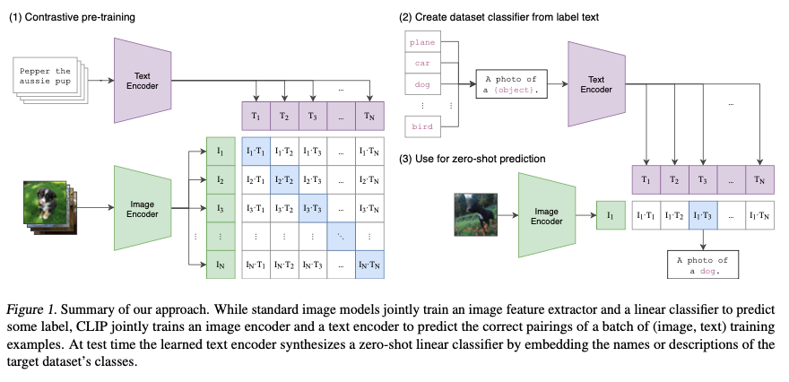
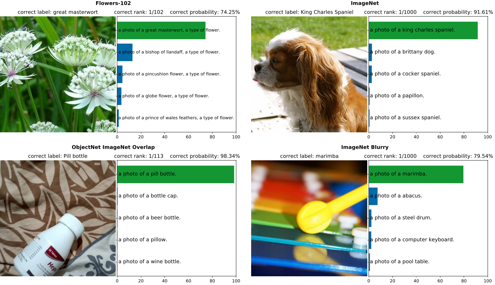
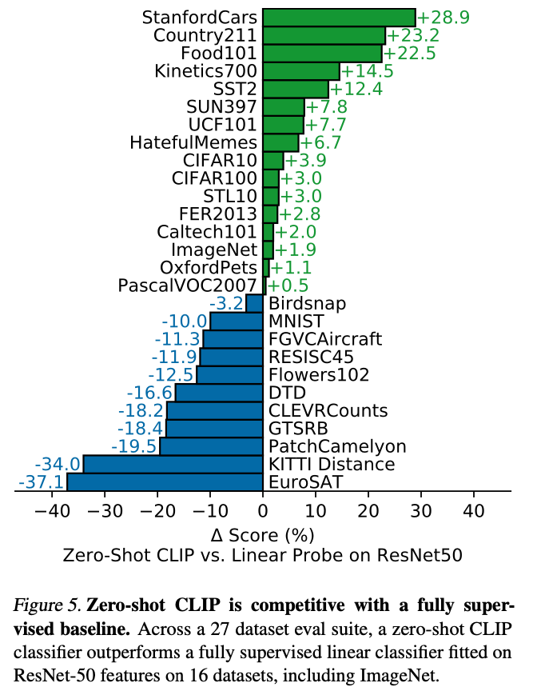

Radford ICML'21 CLIP (Learning Transferable Visual Models From Natural Language Supervision)
=============================================================================================

- 著者: Alec Radford, Jong Wook Kim, Chris Hallacy,Aditya Ramesh,Gabriel Goh,Sandhini Agarwal, Girish Sastry, Amanda Askell, Pamela Mishkin, Jack Clark, Gretchen Krueger, Ilya Sutskever

  - 所属: OpenAI

- https://proceedings.mlr.press/v139/radford21a

概要
------

- インターネットから4億ペアの画像とその画像に対するキャプション持つデータセットを構築
- その大規模な学習データで学習し、ユーザーがクラスセットを自由に設定できる画像クラス分類器を提案

  - 学習: 画像のencoderと言語のencoderを用意してMetric Learningする (今までのMetric Learningとは規模が違う)
  - 推論

    - ユーザーが与えたクラスセット(犬、猫、鳥、・・)を「a photo of (クラス名)」として言語encoderに入れてembeddingを得る
    - 画像を画像encoderにいれてembeddingを得る
    - 内積を取ってTop 1のクラス名を得て、それを分類結果とする

提案法
---------

推論している様子

実験
---------

- 画像側のモデル: ViT (L/14-336px) (ResNet50とかでも実験している)
- 言語側のモデル: Transformer (12-layer 512-wide with 8 attention heads)
- batch size : 32,768
- V100 256個で12日 (ResNetのでかいモデルだと512個で18日)

教室あり学習したモデルに対して16勝11負

- 特定の領域に特化したものや複雑なデータセットでは負けるらしい

  - EuroSAT (衛生画像)
  - KITTI Distance (一番近い車までの距離の画像)
  - PatchCamelyon (リンパ節切片の病理組織学的スキャンから抽出された画像)

