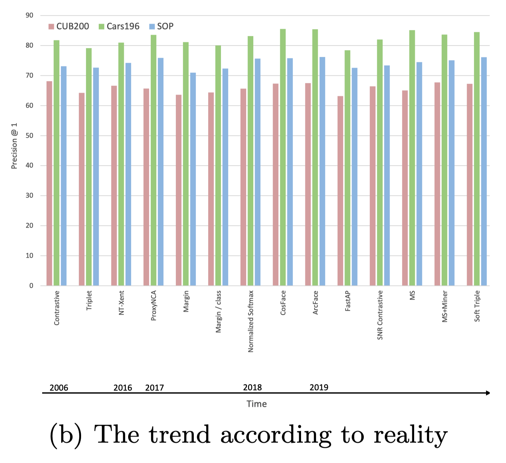
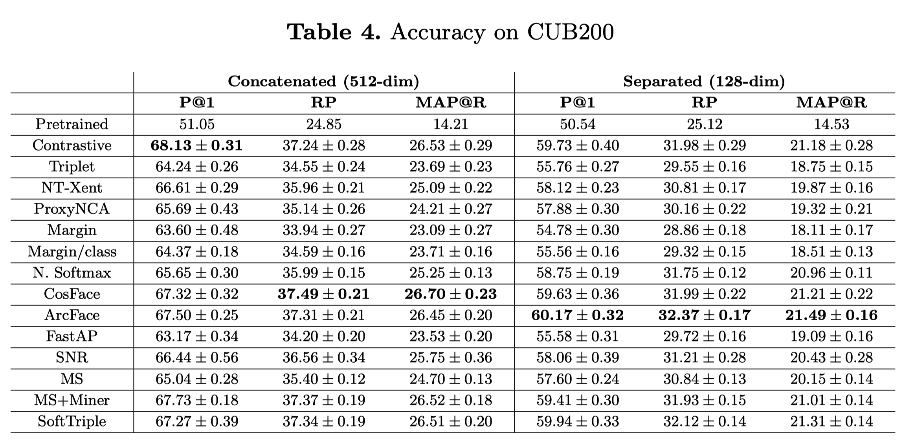

Musgrave ECCV'20 A Metric Learning Reality Check
===================================================

https://arxiv.org/abs/2003.08505

著者

- Kevin Musgrave (Cornell Tech)
- Serge Belongie (Cornell Tech)
- Ser-Nam Lim (Facebook AI)

概要
------

- Metric Learningは、Constructive Lossから精度の意味で大して進歩してないのでは?と言っている論文

- 実装が参考になる https://github.com/KevinMusgrave/pytorch-metric-learning

- Metric Learning論文でよく使われる3つの画像データセット(CUB200, Cars196, SOP) を使う

- クエリの画像と同じクラスの画像をTOP1に持ってこれるか (Precision@1) を評価したもの

.. image:: ../img/ml/cars196.png
  :scale: 40%
  :align: center

- Fig. (a)は、各々の論文中で報告されているP@1

  - Constractive, Triplet, Semihard Miningについては、すべての論文の平均を取っている

.. image:: ../img/ml/rc/f2a.png
  :scale: 40%
  :align: center

- Fig. (b)は、著者らが実験した結果

なぜこんなことが起きているのか
--------------------------------

- ハイパーパラメータチューニングがされていない/不十分
- 実験設定が揃っていない

  - Network Achitecure

    - GoogleNet < ResNet50なのに既存法はGoogleNet使っていたりとか

  - Optimizer choice (SCD, Adam, RMSprop,...) and learning rate
  - Data augmentationなどの細かいテクニック

著者らの実験設定
-------------------

- ImageNetで事前学習したBN-Inception network (embedding dim=128)
- batchsize = 32

  - embedding lossでは、8クラスごとに4sample
  - classification lossでは、32クラスごとに1sample

- 学習中、画像はrandom resized cropping strategyを使って augmentationされる

  - 短辺の長さが256になるようにリサイズして
  - 40~256の間のサイズ、3/4 ~ 4/3の間のアスペクト比になるようにランダムなクロップをする
  - このクロップは227 × 227 にリサイズされ、50%の確率で左右反転する

- OptimizerにはRMSpropを使う (学習率1e-6)

  - SGDより収束がはやく、Adamより精度がよかった

- Embeddingはロス計算と評価の前にL2正規化する

ハイパーパラメータチューニング
^^^^^^^^^^^^^^^^^^^^^^^^^^^^^^^^^^^

- 各クラス前半のデータをcross validation用に、後半のデータをtest用に使う

  - cross validation用のデータを4つにわけて、そのうちの3つをtraining、1つをvalidationに使う
  - validation dataのaccucaryが停滞したら、学習をストップする

- Bayesian Optimization (50 iterations) でbestなやつを探す

  - validation accuracyの平均が一番高いやつを採用する
  - BOの具体的な手法のことは書いてない
  - https://kevinmusgrave.github.io/powerful-benchmarker/papers/mlrc/#optimization-plots からplotが見れる

    - https://kevinmusgrave.github.io/powerful-benchmarker/papers/mlrc_plots/cub_contrastive.html

評価手法
^^^^^^^^^^^

cross validation用のデータを4つに分割するので、4つのモデル(Embedding)ができるので、次の2つのやり方で性能評価する

1. Concatened (512dim) 4つのモデルのEmbedding(128dim)を結合して、512次元として使う
2. Separated (128dim) 4つのモデルそれぞれで評価して、平均を取る

実験結果
----------

**CUB200**

- 200種類の鳥の画像 (ほとんどが北米に生息)
- サンプル数: 6,033
- http://www.vision.caltech.edu/visipedia/CUB-200.html

**Cars196**

- 196クラス(車種)の車の画像
- サンプル数: 16185
- https://ai.stanford.edu/~jkrause/cars/car_dataset.html

.. image:: ../img/ml/rc/t5.png
  :scale: 40%
  :align: center

**Stanford Online Products(SOP)**

- 22634クラスのオンラインショッピングの商品画像
- サンプル数: 120k
- https://cvgl.stanford.edu/projects/lifted_struct/

