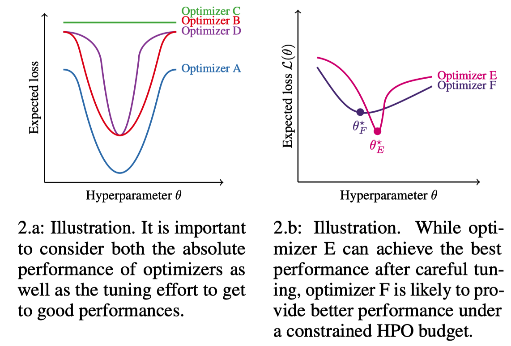
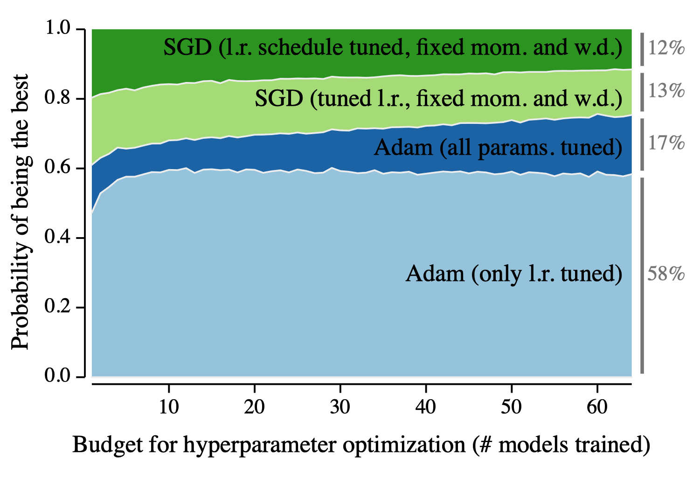
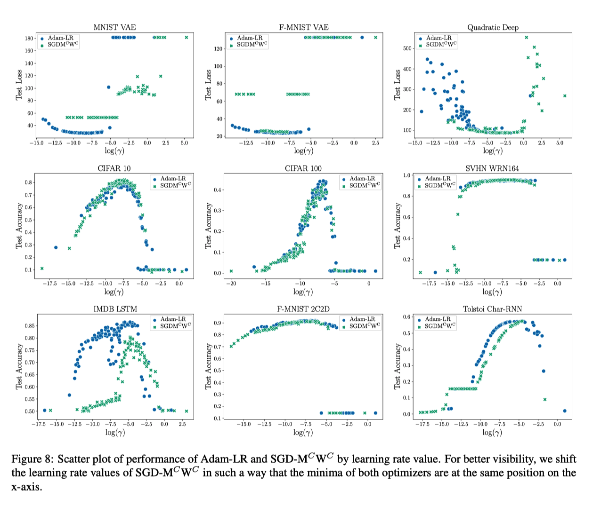
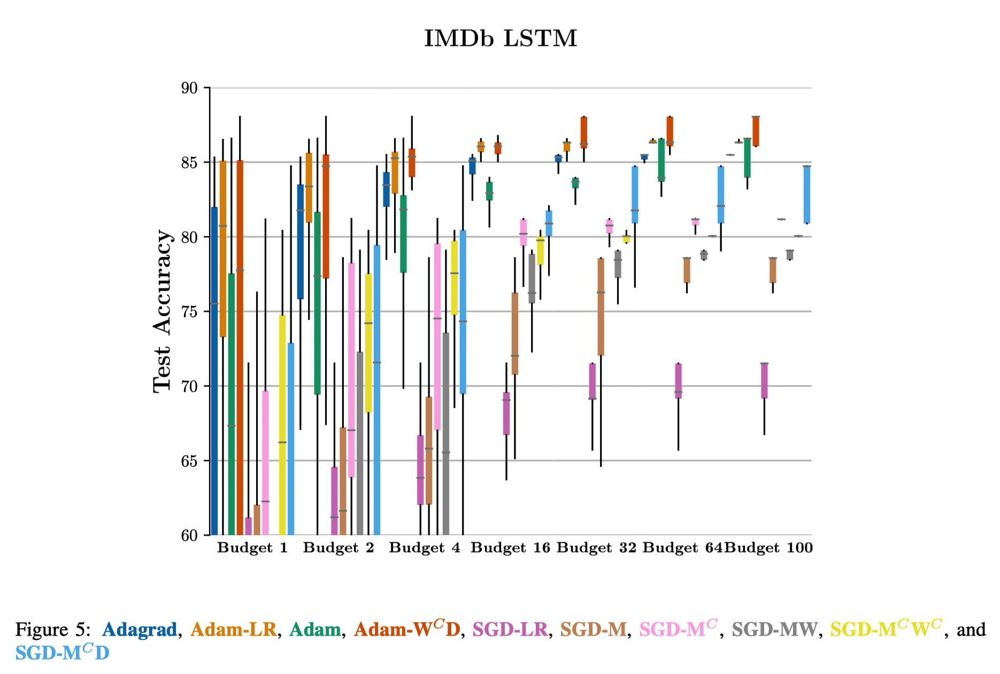

Teja ICML'20 Optimizer Benchmarking Needs to Account for Hyperparameter Tuning
====================================================================================

https://arxiv.org/abs/1910.11758

著者

- Prabhu Teja S (Idiap Research Institute, EPFL)
- Florian Mai (Idiap Research Institute, EPFL)
- Thijs Vogels (EPFL)
- Martin Jaggi (EPFL)
- François Fleuret (EPFL, University of Geneva)

概要
------

- SGDのほうが、Adam等のAdaptive Methodより汎化性能がよいといわれている
- でもSGDのチューニング大変で、あんまりチューニングしないのであればAdamのほうが性能良かったりするよ的な感じ

- (a)図でいくと、Optimizerの良さは明確で A > B > D > C
- SGDはOptimzier-E、AdamはOtimizer-Fみたいな感じ

- x軸: 何回チューニングするか, y軸: ベストな性能である確率

実験
------

Fig 2 を実際に実験してやった感じ

- めちゃくちゃ実験しているので論文を参照

