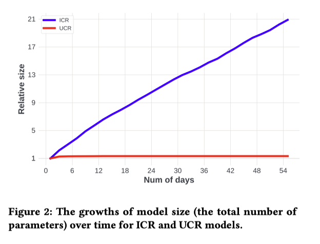

Zhao (KDD'23) Breaking the Curse of Quality Saturation with User-Centric Ranking
==============================================================================================================================

著者

- Zhuokai Zhao (University of Chicago)
- Yu Shi (Meta)
- Yang Yang (Meta)
- Wenjie Hu (Meta)
- Wenyu Wang (Meta)
- Haotian Zhang (Meta)
- Chihuang Liu (Meta)
- Shuang Yang (Meta)

INTRODUCTION
------------------

- スケーリングはDLの主要テーマの一つであり、以下の分野で目を見張るようなブレークスルーをもたらした

  - CV[ViT, GITを引用]

    - 例えば、ImageNetにおいて、ViTはResNet-152と比較して、画像分類エラー率を半分以下に減少させた

  - NLP[GPT-3, PaLM, Bertを引用]
  - multi-modality modeling[CLIP, DALL-E, CoCa]

- しかし、スケーリングの成功は、ランキング（検索、広告、推薦システムなど）ではまだ起こっていない

  - AI業界で最もインセンティブが高いアプリケーションであることを考えると、これは驚くべきことであり、また不思議なことでもある
  - 豊富なデータ量（Google広告、Facebookニュースフィード）があっても、ランキングモデルは通常数日から数週間のログデータしか利用せず、訓練データ量、モデルサイズを増やしても、品質の向上しない (quality saturation problem)

- 我々はこの問題を調査し、根本的な原因の1つが定式化にある可能性があることを発見した

  - NLPになぞらえれば、現在のランキングの定式化は、「アイテム」を「トークン」、「ユーザー」を「ドキュメント」と見なすことで、dyadic responses（例えば広告のクリック）を予測するもので、Item-Centric Rankingと呼ばれる(?)
  - データ量が増加するにつれて、モデルサイズや学習すべきパラメータ数は直線的に増加するため、これは実際には不合理な定式化である (学習データの期間を増やすことで、item数が増加してembedding layerのパラメータが増えるということ)
  - その解決策として、「ユーザー」を「トークン」、「アイテム」を「ドキュメント」と見なす、User-Centric Rankingの定式化を導入する
  - この定式化には多くの利点があり、かなり大きなデータセットで訓練してもQuality Saturation(精度が上がらない問題)が少ないことを示す (示せてないと思う)

RANKING FORMULATIONS
--------------------------

ランキングでは、dyadic responsesのモデル化に関心がある

- ある時間における任意のユーザとアイテムに対して、ラベル(広告のウリックやアカウントのフォロー等)を予測することが目的
- 興味深い点は、NLPは「ドキュメント」と「トークン」の間の二項相互作用(dyadic interactions)として考えることができるため、ランキングには NLP と多くの類似点がある (?)
- 実際、多くのランキング手法は NLP の進歩に影響を受けている [GRU4Sec, BERT4Rec, Deep Interest Network]

Item-Centric Ranking (ICR)
""""""""""""""""""""""""""""""

NLPに類似した重要なアイデアは、アイテムをトークンとして、ユーザーをドキュメントとして考えること

- つまり、各ユーザーは、エンゲージメントの時間に従って時系列に、エンゲージしたアイテムのリストによってモデル化される

  - itemが学習されるembedding, ユーザーはitem embeddingを集約して表現する
  - 複数のタイプのエンゲージメントが関与している場合（例えば、ビデオ推薦では、クリック、ビデオ完了、いいね、フォローなど）、エンゲージメントのタイプごとに1つずつ、複数のチャネルに編成することができる。

なぜランキングモデル(ICR)はすぐに飽和してしまうのか?

- NLPモデルには多くの類似点があるのに、なぜそうならないのだろうか?
- この2つの設定を注意深く比較すると、重要な違いがあることに気づく
- NLPでは、語彙サイズは固定されていることが多いが、ICRは違う

  - アイテムの在庫は非常に動的で
  - 新しいアイテムが絶えず作成され (Facebook/Instagramでは毎日何千万もの投稿/動画が作成される)
  - アイテムは時間に敏感で刹那的

- アイテムのインベントリは時間の経過とともに線形に成長するので、パラメータの数は(アイテムごとの埋め込みを使用するため)時間経過で増大する
- 学習データを増やしても (使う日数を増やす)、モデルサイズが線形成長するため、パラメータあたりのデータ密度は上がらない

User-Centric Ranking (UCR)
""""""""""""""""""""""""""""

- UCRは「ユーザー」を「トークン」、「アイテム」を「文書」と見立て、ユーザーを学習するembedding parameter、アイテムはそれを集約によって表現する
- 成熟したランキングシステムでは、ユーザー集合は比較的一貫したまま
- そのため、学習データを増やしてもパラメータごとのデータ密度が一貫して増加する
- ICRでは、アイテムは刹那的であるため、その埋め込みも刹那的である（つまり、アイテムの埋め込みは、そのアイテムがシステムを抜けると、すぐに無関係になり、役に立たなくなる
- UCRでは、ユーザがシステムとインタラクションし続ける限り、全てのユーザに関する知識を継続的に蓄積し改善されていく

Hybrid Models
""""""""""""""""""""""""""

- ハイブリッド定式化も可能であり、どっちもやるだけ
- 図1(a)をハイブリット化したものが、図1(b)
- ICRを同じ「パラメータ爆発」問題を持つ

IMPLEMENTATION
--------------------------

User-Centric Ranking
""""""""""""""""""""""""""

UCRを実装するための課題の一つは、分布の歪みを扱うこと

- ICRでは1人のユーザーが関与できるアイテムの数は均等に分布する傾向がある（例えば、毎日の関与は数個から数百個の範囲)
- UCRでは分布はより不規則

  - あるアイテムは何百万人ものユーザーと接触があるが、他のアイテムは数人しかない、みたいな

- 学習/推論中に、接触したユーザーのリスト全体をメモリに収めることはもはや不可能
- それに対処するために、3つの異なるアプローチを検討する:

  - Samling: 一様にダウンサンプリングするだけ (UC-Samplingと呼ぶ)
  - Aggregation: ユーザーを(Louvainアルゴリズムで) クラスタリングし、user-idの代わりにcluster-idを使用する。 (UC-Clusteringと呼ぶ)
  - Retrieval: エンゲージメント履歴のインデックスを事前に作成し、検索（例えば、最大内積検索）を使用して、最も関連性の高いユーザーのサブセットを特定し、その上でAttention Poolingを適用する。(計算コストが重いので実験しない、のちの研究に任せるらしい)

- 実験で用いたデータは大半のアイテムのエンゲージメント・ユーザーは1024を下回っている

Parameter Hashing
"""""""""""""""""""""""

- 各IDに対して1つずつ埋め込みベクトルを学習することを考えると、メモリに乗らない
- この問題に対処する一つの一般的なアプローチは、特徴ハッシュを実装すること

  - これらのIDのために一定のハッシュ空間を保持し、それぞれの特徴的な「ハッシュ化されたID」に対して一つの埋め込みベクトルを割り当てる
  - ハッシュの衝突があるということは、特定のランダムなIDに同じ埋め込みベクトルを共有することになり、理想的ではない
  - しかし、衝突率が妥当なレベルであればドロップアウトに似た一種の正則化効果を与えるため、必ずしも悪いことではない
  - ICRでは時間経過とともに衝突率が上がっていくが、UCRは一定 (この論文の設定では)

EXPERIMENTS
--------------------------

On Public Data
"""""""""""""""""

- 本論文の目標は、アイテムの増大によって引き起こされる Quality SaturationがUCRによって解消されるのを検証すること
- そのためには、データセットは大規模で、実世界のシステムと同様に動的に在庫アイテムが変動する必要がある
- 残念ながら、公開されているデータはこの要件を満さない
- この問題はランキングの分野ではさらに深刻で、公開されたデータは規模が小さすぎるだけでなく、実世界のシステムが持つ多くの重要な特徴を欠いている
- そのようなデータセットで得られた知見を実世界に一般化する際の信頼性が低くなっている
- しかしながら、再現性のためにある公開データセットで検証

**Data**

- MovieLens-20M は推薦システムでよく使われる
- 27,278本の映画に対して、138,493人のユーザーの2,000万件の評価が含まれている
- Deep interest network (DIN)論文と同様に、4つ星以上の評価はポジティブ、それ以外はネガティブとして扱う
- ICRでは、各ユーザーについて直近N(=512)個ポジティブに評価された映画を使う
- UCTRでは、各映画に対して、評価したM(=512)ユーザを使う
- ICRとUCRの差を比較するので、ジャンルなどの他のカテゴリー的特徴は使わない

**Results**

- UCRはICRと比べて優れていて、Hybridは多くのシグナルを使用するため最高のパフォーマンスを発揮している
- MovieLens は静的なデータセットで、実世界のシステムのような動的な変動がないため、パラメータの爆発を見ることができない

On Real-World Production Data
""""""""""""""""""""""""""""""""

**Data**

- 現実世界の短編動画推薦システムのログをサンプリングして作成 (Lab data)
- 60日間（2022年7月下旬から10月上旬まで）の約2,400万人のユーザーとそのエンゲージメント活動が含まれている
- 合計約280億のexample（エンゲージメント活動）が含まれている

  - エンゲージメントは、1種類のネガティブなものと5種類のポジティブなもの

**Parameter Growth**

- 図2: ICRとUCRモデルの時間経過に対してのモデルサイズの成長をプロット
- 最初の数日間は、ICRモデルのパラメータが少ないが、新しいアイテムが出現するにつれて毎日パラメータが増加する
- そのため、ICRのモデルサイズは時間とともにほぼ直線的に成長
- 対照的に、UCRのモデルサイズは時間の経過とともに比較的安定
- 60日経過した時点で、ICRモデルのサイズはUCRモデルの21倍

  - 平均して各IDエンベッディングがICRで受け取る学習データは、UCRと比較して21倍少ない
  - ハッシュを使う場合、衝突率が21倍

**ICR vs. UCR**

.. image:: ../img/other/ucr_fig3.png
  :scale: 80%
  :align: center

- 6つのエンゲージメントがあるが、特定の1つを使って実験する (そのサンプルが1つ選んだエンゲージメントであるかどうかの分類問題?)
- 図3: 最初の1日目のIC-Sampling Sum PoolingのNCE(Normalzied Cross Entropy)を1を基準としたRelative NCEをプロット
- UC-SamplingはIC-Samplingと比べて性能がよく、その差は1日目から10日目まで急速に拡大
- しかし、それ以降、差は日数の経過で拡大せず平行線を辿っている
- UCRはアクティブなユーザーに対してはより秀でているが、あまりアクティブでないユーザーに対しては不十分であるためだと考えている

**Segment Analysis**

.. image:: ../img/other/ucr_fig6.png
  :scale: 80%
  :align: center

- ユーザーをアクティブ度に基づいて、5つのバケットにセグメント化
- 図6(a)では、各ユーザセグメントについて、UC-SamplingとICR-SamplingのNCEの差をプロット
- 全体としてUCRの方がICRよりも性能が良いが、その差は主にアクティブなユーザーから得られている
- Hybridはどっちも使えるので最良の結果になる (主張したいこととずれるのでは・・・)

**Sampling vs. Clustering**

.. image:: ../img/other/ucr_fig4.png
  :scale: 80%
  :align: center

- AggregationはSamplingのほうが良かった
- ただ、クラスタリングはアルゴリズムによって変わるのでより優れたアルゴリズムがあった場合、また結果が変わってくる可能性がある

**Hybrid Method**

- HybridをUCRは同じような性能だが、わずかに良い
- HybridがUCRとICRの両方を含んでいることを考慮すると、結果は予想通り(UCRとICRの両方の利点を持つはず）であり、また意外でもある（ICRと同じパラメータ爆発問題がある）

  - (どっちやねん)

**Multi-Task Evaluation**

.. image:: ../img/other/ucr_tab2.png
  :scale: 60%
  :align: center

- これまでの評価では、特定の１つのエンゲージメントを使っていたが、ここでは6つのタスク全てについてモデルを共同で訓練する
- UCRがICRより良くて、HybridはUCRと大差はないが最良

**Ablation Study**

(ハイパラをいじっているだけでAblation Studyって感じはしないが)

異なる設定がモデルの性能にどのような影響を与えるかを調べた (学習データ量には30日間を使用)

- Hash size

  - ハッシュサイズをデフォルト値の2000万から変化させて、モデルの性能にどのような影響を与えるかを調べた
  - 全体として、ハッシュサイズを大きくすることが、より良いモデル性能につながる
  - この傾向はUCRにおいてより顕著である (token数がICRより少なくて衝突率がより改善する)

.. image:: ../img/other/ucr_tab3.png
  :scale: 80%
  :align: center

- Embedding Dimensionality

  - デフォルトの埋め込み次元は192で、96から384の間で調整する
  - IC-Samplingは最大の次元を使用すると性能が悪化するが、UC-Samplingは改善する

Online Results
""""""""""""""""""""

- full-scale production dataにおいてアーキテクチャを変更することなく、数日間のトレーニングデータを用いてUCRモデルを学習したところ、本番のICRモデルと比較してNCEで最大0.6%の向上が観察された
- 本番システムでのABテストを実現するために、多くのインフラ最適化を行った

  - バッチ計算の最適化
  - FP16を使用して品質を大幅に低下させることなく、スループットとレイテンシーをを向上させることができ、サービングに必要なGPU数を半分に削減

- ABテストでは、特に主要なビジネスメトリクスの1つである動画視聴時間を3.24%改善
- 学習データを増やすことは現在検討中

Open Questions and Discussions
"""""""""""""""""""""""""""""""""

- ランキングにおけるQuality Saturationの緩和に取り組むことを動機としているが、これは部分的にしか検証されていない
- しかし、それ以降、差は日数の経過で拡大せず平行線を辿っている
- これは驚くべきことである

この食い違いを理解するために、いくつかの仮説を立てた

- Lab dataのサンプリングが良くなかった。full-scale production dataではうまくいくはず

  - (ちょっとよくわからない)

- ランキングはCVとNLPとは違って動的

  - CVやNLPはモデル化しようとする概念は静的で真のモデルがあり、目標はそのモデルに近づくこと
  - しかし、ランキングでは根本的に異なる
  - 非常にダイナミックな双方向のシステムと反実仮想な性質のために、大幅かつ頻繁なドリフトが発生する分布ドリフトによって、真実のモデルは存在しない
  - あるいは、最適なモデルは静的なものではなく、移動する目標であるとも言える

- モデルのアーキテクチャの表現力が低い

  - NLPやCVで使われているよりも大幅にパラメータ数が少ない
  - より表現力の高いモデルであれは、改善するのでは

これらの検討は今後の研究に委ねたい
