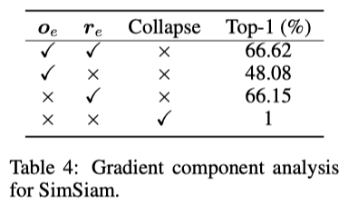
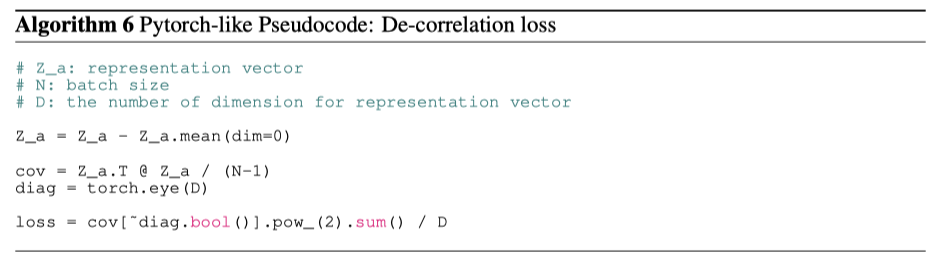
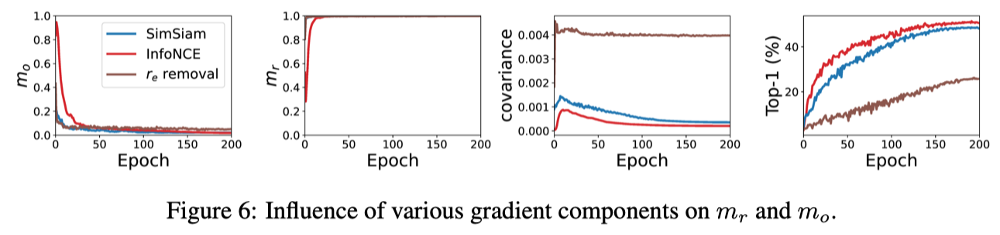

Does ICLR'22 How Does SimSiam Avoid Collapse Without Negative Samples?
========================================================================

- How Does SimSiam Avoid Collapse Without Negative Samples? A Unified Understanding with Self-supervised Contrastive Learning
- 著者: Chaoning Zhang*, Kang Zhang*, Chenshuang Zhang, Trung X. Pham, Chang D. Yoo,  In So Kweon (KAIST)
- https://openreview.net/forum?id=bwq6O4Cwdl https://arxiv.org/pdf/2203.16262.pdf

Abstract
----------

- SimSiamがなぜnegative sampleを用いず学習の崩壊を防げているのかの理由はまだ十分に解明されていない
- まずSimSiamにおける説明的主張を再検討して、それに反論する
- そして、表現ベクトルを中心成分と残差成分と分解して、predictorを外したシンメトリックなSimSiamは崩壊を防ぐことができず、アシンメトリックにするとextra gradientが出てきて、その中心ベクトルは de-centering効果によって、残差ベクトルはdimensional de-correlation によって崩壊を防ぐ (???)

??? という感じですが、とりあえず先に進んでいきます。

predictorはEOA近似のギャップを埋めているのか?
------------------------------------------------------------------------------

(SimSiam論文の仮説への反論)

EOAって? Expectation over augmentations のこと  (:math:`\mathbb{E}_{\mathcal{T}}[\cdot]` )

.. image:: ../img/ssl/how_fig1.png
  :scale: 80%
  :align: center

- 図1(a)のようにSimSiamのpredictorはstop gradientしない方のencoder側にある
- SimSiam論文のProof of concept(5.2節) でやったmoving-averageは図1(b)のようになる
- predictorをEOAと解釈するのは図1(a)というより図1(c)になる。
- なので、SimSiamのpredictorをEOAとみなすのは無理がある

SimSiam論文では、「:math:`\mathbb{E}_{\mathcal{T}}[\cdot]` を計算するのは非現実的だが、:math:`\mathcal{T}` が複数のepoch間で暗黙的に分散しているならpredictorが期待値を予測することは可能かも」と言っているが、
本論文は十分に大きい数 :math:`\mathcal{T}` からサンプリングして、最新のモデルを通したものの平均をとったほうがより有効でしょうと言っている。

しかし、そうしてしまうとTable 1に示すとおりモデルは崩壊してしまう。 (やっぱりpredictorをEOAとみなすのは無理がある)

Asymmetric interpretation of predictor with stop gradient in SimSiam
------------------------------------------------------------------------

話は変わって、どういう構造なら崩壊して、どういう構造なら崩壊しないのか　という話になる
(なぜ崩壊しないのか？の答えではない)

.. image:: ../img/ssl/how_fig2.png
  :scale: 80%
  :align: center

- 図2(a) Naive SimSiam: SimSiamからpredictorを除いたものは崩壊する　(Table 2)
- 図2(b) Symmetric Predictor : stop gradientする方にpredictorをつけたものも崩壊する　(Table 2)

  - 図2(b)は結局図2(a)の :math:`f(x)` を :math:`h(f(x))` とみなすだけなので、崩壊する

- 図2(c) Inverse Predictor : 図2(b)のstop gradientする方にpredictorの逆関数をつけると崩壊しない　(Figure 3)

|pic1| 　 |pic2|

.. |pic1| image:: ../img/ssl/how_tab2.png
   :width: 45%

.. |pic2| image:: ../img/ssl/how_fig3.png
   :width: 45%

Inverse predictorなんて用意できるのか?

- Inverse predictor :math:`h^{-1}` も同時に :math:`P, Z` の距離を近づけるように学習する

  - 図3が示すように :math:`h^{-1}` は学習可能である
  - :math:`h^{-1}` は理論的にrandom augmentation :math:`\mathcal{T}'` を restore　できないので SimSiamにおけるpredictorはEOAではないさらなる証拠だと主張している (よくわからない)

Vector decomposition for understanding collapse
---------------------------------------------------

- :math:`z` : representation vector  (:math:`z=f(x)`)
- :math:`Z` : zを正規化したもの (:math:`Z=z/\|z\|`)

.. math:: \mathcal{L}_{MSE} = (Z_a - Z_b)^2 / 2 = -Z_a \cdot Z_b = L_{cosine}
  :label: how1

- :math:`P` : normalized output of predictor ( :math:`P = p / \|p\|` )

.. math:: \mathcal{L}_{SimSiam} = - (P_a \cdot sg(Z_b) + P_b \cdot sg(Z_a))
  :label: how2

:math:`Z` を :math:`Z = o + r` と2つのベクトルに分ける

- center vector :math:`o` : Zの期待値 (:math:`o_z  = \mathbb{E}[Z]` )だが、minibatch内の標本平均で近似する :math:`o_z = \frac{1}{M}\sum_{m=1}^M Z_m`
- residual vector :math:`r` : Zの残差成分 (:math:`r = Z - o_z`)

- ration of o :math:`m_o := \| o \| / \|z\|`
- ration of r :math:`m_r := \|r\| / \|z\|`

崩壊が起こると、:math:`Z` は center vector :math:`o` に近くなり、:math:`m_o` は1に近くなり、:math:`m_r` は0
に近くなる。 なので、 :math:`m_o \gg m_r` となるとき、崩壊していると解釈する。

**推測1** :math:`Z_a = o_z + r_a` とすると、:math:`o_z` の勾配成分は :math:`m_o` を増加させ、:math:`r_a` の勾配成分は逆に :math:`m_r` を増加させる。

推測1を検証するために、dummy gradient term :math:`Z_a` に立ち返る。 :math:`-Z_a \cdot sg(o_z)` と :math:`-Z_a \cdot sg(r_a)`  2種類のロスをデザインして、それぞれ、:math:`o` と :math:`r_a` のgradient componetの影響を調べたのが図4.

.. image:: ../img/ssl/how_fig4.png
  :scale: 70%
  :align: center

gradient component :math:`o_z`　は :math:`m_o` を増加させ、gradient component :math:`r_a` は :math:`m_r` を増加させることがわかる。

**Extra gradient component for alleviating collapse**

ロス関数の negative gradient

.. math:: - \frac{\partial \mathcal{L}_{MSE}}{\partial Z_a} = Z_b - Z_a \Leftrightarrow -\frac{\partial \mathcal{L}_{cosine}}{\partial Z_a} = Z_b
  :label: how3

, where the gradient component :math:`Z_a` is a dummy term because the loss :math:`- Z_a \cdot Z_a = -1` is a constant having zero gradient on the encoder :math:`f`.

式 :eq:`how3` はtwo equivalent formsとして解釈でき :math:`Z_b - Z_a` を選ぶと (???)、
:math:`Z_b - Z_a = (o_z + r_b) - (o_z + r_a) = r_b - r_a` になる。
:math:`r_b` は :math:`r_a` と同じpositive sampleから来ているので、:math:`r_b` も同じく :math:`m_r` を増加させることが期待されるが、その効果は :math:`r_a` より小さいので (???)、崩壊の原因になる.

よくわかんないポイント

- その効果は :math:`r_a` より小さいのはなぜ ( :math:`r_b - r_a` が小さくなるならわからんでもない )
- :math:`Z_b - Z_a` ではなく、:math:`Z_b` を選ぶと :math:`o_z + r_b` だけど
- そもそも :math:`Z_a` で微分したものを見て何になるのか (微分したものを見るというのは感覚的にわかるが、なんで :math:`Z_a` で微分したものでよいのかの議論がほしい)

図2(a)のnegative gradient on :math:`Z_a` は :math:`Z_b`, 図2(b)のnegative gradient on :math:`P_a` は :math:`P_b` となる。 :math:`Z_b, P_b` を Basic Gradientとする. 上記の解釈から Basic Gradient では崩壊を防ぐことができないので、対称性を壊すために余分な成分を導入する必要がある。その余分な成分を Extra Gradient と呼び、:math:`G_e` と表記する.

例えば図2(a)に negative sample を導入することで、negative sampleによる余分な成分( :math:`G_e` )があるので崩壊しない。同様にSimSiamの :math:`P_a` についての負の勾配 :math:`Z_b` を basic gradient :math:`P_b + G_e` と導出することも可能である ( :math:`G_e = Z_b - P_b` )。　???

( どういうことなのか??? 言葉遊びしてるだけに見える。)

**どの成分が崩壊を防いでいるのか?**

:math:`G_e` を :math:`Z_a` と同じように center vectorと residual vectorに分解する ( :math:`G_e = o_e + r_e` )
:math:`G_e, o_e, r_e` どの成分が崩壊を防いでるのか、triplet loss :math:`\mathcal{L}_{tri} = - Z_a \cdot sg(Z_b - Z_n)` , ( :math:`Z_n` はnegative sampleの表現ベクトル ) で実験してみる。:math:`Z_a` についてのnegative gradientは :math:`Z_b - Z_n` で :math:`Z_b` が basic gradientなので、 :math:`G_e = - Z_n` となる。

表3に :math:`Ge` の代わりに :math:`o_e, r_e` を入れてみたときの学習結果を示す。
:math:`o_e` が崩壊を防いでいるのがわかり、:math:`r_e` だけでは崩壊して、 :math:`r_e` を保持している :math:`G_e` だと精度が低下する。 negative sampleはランダムに選ばれるため、 :math:`r_e` は最適化においてランダムノイズのように振る舞い、性能を低下させる (???? そうなの???)

.. image:: ../img/ssl/how_tab3.png
  :scale: 80%
  :align: center

SimSiamの :math:`P_a` における負の勾配は以下

.. math:: -\frac{\partial \mathcal{L}_{SimSiam}}{\partial P_a} = Z_b = P_b + (Z_b - P_b) = P_b + G_e

triplet lossでやったような実験をすると、表4になる

予想どおり :math:`G_e` を取り除くと崩壊して、:math:`o_e, r_e` の両成分を残すと最高の性能を発揮する (そうなの???)
興味深いことに :math:`o_e, r_e` のどちらかを残せば崩壊しない。 推論1にもどついて、 :math:`o_e` がどのような影響を与えるのか分析する。

**SimSiamで o_e がどのように崩壊を防いでいるのか**

:math:`G_e = Z_b - P_b` なので、:math:`o_e = o_z - o_p` である。 推論1によると( :math:`P_a` についてみているので)　負の :math:`o_p` は崩壊を防ぐので :math:`o_e` は崩壊を防ぐ.

:math:`o_p` がどれくらい :math:`o_e` に影響しているかをみるために、
図5に、スカラー :math:`\eta_p` を動かしたときの :math:`o_e - \eta_p o_p` と :math:`o_p` のコサイン類似度を示す。
:math:`\eta_p` が :math:`-0.5` くらいのとき、コサイン類似度が0になるので、:math:`o_e \approx -0.5 o_p` になる.

(直角になってもコサイン類似度0じゃないのか?と思ったけど、 :math:`\eta_p` はスカラーなので、直角になることはないから コサイン類似度が0ということは、 :math:`o_e - \eta_p o_p` が0になるしかにということ?)

というわけで、 :math:`o_e` がSimSiamが崩壊するのを防ぐ

.. image:: ../img/ssl/how_fig5.png
  :scale: 80%
  :align: center

triplet lossの実験では :math:`r_e` を維持すると精度下がったが、SimSiamでは :math:`r_e` だけでも崩壊を防いで :math:`G_e` と同等の性能を達成している。これは次で説明する dimensional de-correlation の観点から説明できる。

**推論2** dimensional de-correlation が :math:`m_r` を増加させると考える。動機は単純で、次元の相関が最小になるのは、1つの次元だけが個々のクラスに対して非常に高い値を持ち、異なるクラスに対して次元が変化する場合であるから．

上記の推測を検証するため、SimSiamの損失 :eq:`how2` で訓練し、式 :eq:`how1` の損失で意図的に :math:`m_r` を0に近づけて数エポック訓練する。次に、付録A.6で詳述する相関正則化項のみを用いて損失を学習させる。図5(b)の結果から、この正則化項が非常に速い速度で :math:`m_r` を増加させていることがわかる。

:math:`h` が :math:`o_e` の影響を排除するためにFC層を一つしか持たないと仮定すると、FCの重みはエンコーダ出力の異なる次元間の相関を学習することが期待される。本質的に、 :math:`h` は :math:`h(Z_a)` と :math:`I(Z_b)` の間のコサイン類似度を最小化するように学習される（Iは同一性写像)。したがって、相関を学習する :math:`h` は :math:`I` に近づくように最適化され、これは概念的には :math:`Z` に対して脱相関を目標に最適化することと等しい。表4に示すように、SimSiamでは :math:`r_e` のみでも崩壊を防ぐことができ、 :math:`r_e` には脱中心化の効果がないため、脱相関効果に起因するものであると考えられる。図6からは最初の数エポックを除き、SimSiamは共分散を減少させている。

(何言ってるかわからない・・・)

