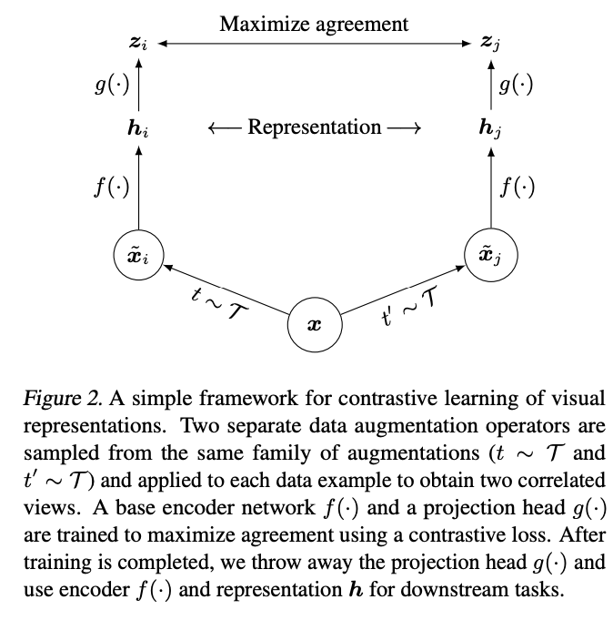
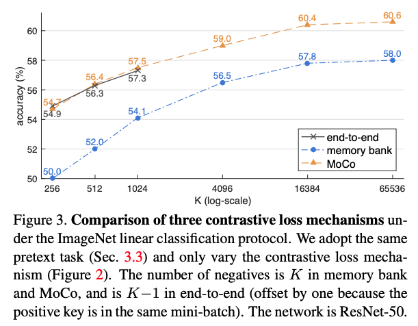
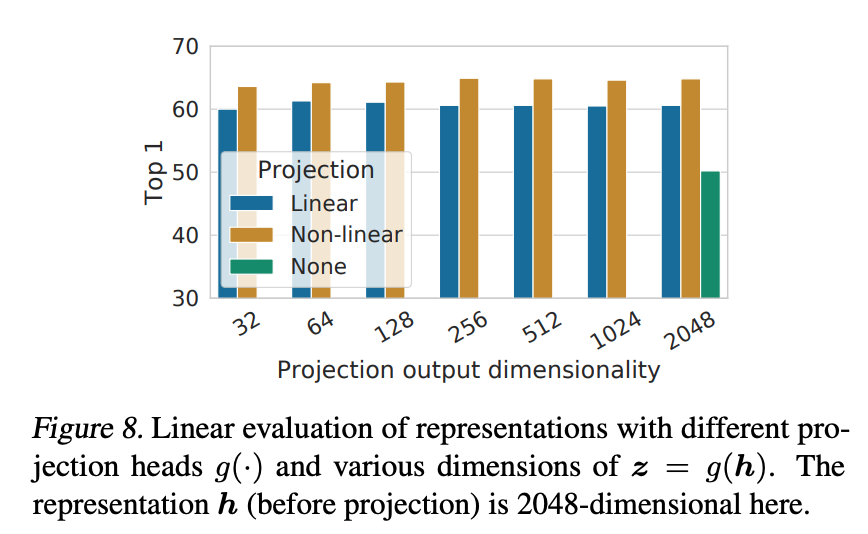

Chen ICML'20 SimCLR (A Simple Framework for Contrastive Learning of Visual Representations)
===================================================================================================================

- 著者 Ting Chen, Simon Kornblith, Mohammad Norouzi, Geoffrey Hinton (Google Research)
- https://arxiv.org/pdf/2002.05709.pdf

Abstract
-----------

- 既存のSelf-Supervised Learning(SSL)の手法(CPC, AMDIM, CMC, MoCo)は複雑だった
- SimCLRはとてもシンプルで、SSL及び半教師付き学習の精度を大幅に更新した

.. image:: ../img/ssl/simclr_fig1.png
  :scale: 60%
  :align: center

- 図1: それぞれの手法でSSL後、モデルの出力を特徴量に線形モデルを学習し、その精度を比較 (Linear Evaluation)

Algorithm
-------------------

ざっくりいうと、以下のような contrastive learning をやっている

- 同じ画像に対して augmentation (どこをクロップするかなどの乱数がある) を2回行い、それをpositive pairにする
- ミニバッチにある、別の画像(をaugmentationしたもの)をnegativeにする
- positive pairの距離は小さくなるように、negative pairの距離は大きくなるようにモデルを学習する

augmentationの種類

少量の教師データを使ったfine tuneタスクでも強い

.. image:: ../img/ssl/simclr_tab7.png
  :scale: 80%
  :align: center

同じクラスの画像をnegativeとして学習しちゃうのはどうなの

- クラスタリングを使ってその課題を緩和する手法はある: 例えば SwAV (https://arxiv.org/pdf/2006.09882.pdf)

先行研究: MoCo
----------------

Momentum Contrast for Unsupervised Visual Representation Learning

- Kaiming He, Haoqi Fan, Yuxin Wu, Saining Xie, Ross Girshick (Facebook AI Research (FAIR))
- CVPR'20 https://arxiv.org/pdf/1911.05722.pdf

- End-to-End (SimCLRのようなやつ)はメモリを使うのでミニバッチサイズ大きくできない

Algorithm
^^^^^^^^^^^^^^^^^^^^^

- 初期値が一緒の　encoder(f_q)　と momentum encoder (f_k) を用意する

以下繰り返し

- 同じ画像に対して 別々のaugmentationを2回行い、それぞれをencoderとmometum encoderに通す

  - momentum encoder を通したほうをqueueに入れておく

- それらをpositive pair、 encoderに入れたものとqueueに入っているものをnegative pairにして metric learningする

  - ただし、momentum encoder の方はstop gradientしておく (勾配を伝搬させない (optimizerの更新対象から外す))
  - momentum encoderのパラメータは momentum updateする (m * f_k.params + (1-m) * f_q.params で更新)

.. image:: ../img/ssl/moco_fig2.png
  :scale: 60%
  :align: center

- stop gradientするからminibatch sizeを大きくできる

あれSimCLRってだたのEnd-to-Endってじゃないか?

SimCLRのContributionって何だったのか
-----------------------------------------

1. augmentationの組み合わせが非常に重要だという知見

- 行: 1回目のaugmentation, 列: ２回目のaugmentation, 色: Linear Evaluationの精度
- cropとcolorの組み合わせが際立って強い

.. image:: ../img/ssl/simclr_tab1.png
  :scale: 70%
  :align: center

- color distortion strengthも重要
- supervised learningだとそうではない、supervisedで強いAutoAugmentationもSSLでは強くない

2. Non linear projection

- Non linear projection (MLP: 全結合→BN->ReLU→全結合->BN) が強い

他にもBatch size、損失関数、損失関数の温度パラメータ、epoch数とかいろいろ実験している

感想
^^^^^^^

- 何か新しいことをやったという気はしない

  - SSLの火付け役的なイメージだった(なんかAlgorithm自体が今までに無いものだと思っていた)
  - 先行研究の論文も読んでみるとSimCLRの貢献はすでにある手法の組み合わせでSSLの強さを引き出したこと

- Augmentation がとても重要ということを教えてくれた (自然言語でもいけるぜとはぜんぜん思えない)

