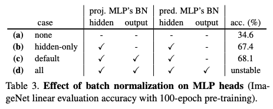

Chen CVPR'21 SimSiam (Exploring Simple Siamese Representation Learning)
========================================================================================================================

- 著者: Xinlei Chen, Kaiming He (Facebook AI Research (FAIR))
- CVPR'21 Best Paper Honorable Mentions https://arxiv.org/pdf/2011.10566.pdf

Abstract
-----------

- BYOLをシンプルにした

  - negative pair 使わない (BYOLと同じ)
  - momentum update 不要  (target networkを使わない)
  - batch size小さくてもOK

Linear Evaluation

- 100epoch以降は、BYOLには負けるが SimCLRとかには勝っている

transfer learning タスクでは強い

.. image:: ../img/ssl/simsiam_tab5.png
  :scale: 60%
  :align: center

Algorithm
---------------

準備

- encoder (backbone + MLP) :math:`f` と predictor (MLP) :math:`h` を用意

以下繰り返し

- :math:`x_1 = \text{aug}(x), x_2 = \text{aug}(x)`
- :math:`f(h(x_1))` と :math:`\text{sg}(f(x_2))` の距離を最小化　(sgは stop gradient)

  - 厳密には入力を入れ替えた :math:`f(h(x_2))` と :math:`sg(f(x_1))` の距離も最小化

Empirical Study
-------------------

(BYOLと同様negative pairを使っていないので、崩壊するように思えるが崩壊しない)

Fig2. Stop gradient しないと崩壊する

- ロスはゼロになるが、出力の各次元の分散は0になり精度は上がらない

.. image:: ../img/ssl/simsiam_fig2.png
  :scale: 60%
  :align: center

Tab1. predictor (MLP) がないと崩壊する

Tab2. batch size大きくしても精度上がらない

.. image:: ../img/ssl/simsiam_tab2.png
  :scale: 100%
  :align: center

Tab3. MLPにBatch Normalization いれないと精度が大きくさがる (一番うしろにBN入れると安定しない)

- BYOLでも同じような結果になるらしい

Hypothesis
---------------

(なぜ崩壊しないかの仮説ではない、SimSiamがどういう学習をしているのかの仮説)

以下のロス関数を考える

.. math::
  :nowrap:

  \begin{align}
    \mathcal{L}(\theta, \eta) = \mathbb{E}_{x, \mathcal{T}} \left[  \| \mathcal{F}_\theta(\mathcal{T}(x)) - \eta_x \|_2^2 \right]
  \end{align}

- :math:`\mathcal{F}` : ネットワーク (それのパラメータを :math:`\theta` とする)
- :math:`\eta` : another set of variables (:math:`\eta` のサイズは画像の数に比例する, :math:`\eta` はネットワークの出力である必要はない)

そして、:math:`\mathcal{L}(\theta, \eta)` を :math:`\theta, \eta` に関して最小化することを考える. 交互最適化で最適化することを考える

.. math::
  :nowrap:

  \begin{align}
    \theta^t &\leftarrow \arg \min_{\theta} \mathcal{L}(\theta, \eta^{t-1}) \\
    \eta^t &\leftarrow \arg \min_{\eta} \mathcal{L}(\theta^t, \eta)
  \end{align}

- :math:`\theta` に関してはSGDで解けばいい.

- :math:`\eta` に関する最適化は 各々の :math:`\eta_x` について独立に解ける.　それでMSEなので、簡単に以下のように解ける.

.. math:: \eta^t_x \leftarrow \mathbb{E}_{\mathcal{T}} [\mathcal{F}_{\theta^t}(\mathcal{T}(x))]
   :label: eq9

SimSiamは (predictorを考えないと) この交互最適化の近似だとみなせる

- :eq:`eq9` は :math:`\mathbb{E}_{\mathcal{T}}` を 一回のaugmentation :math:`\mathcal{T'}` によって近似すると以下になる

.. math:: \eta^t_x \leftarrow \mathcal{F}_{\theta^t}(\mathcal{T'}(x))
  :label: eq10

- :math:`\eta` についての最適化問題に :eq:`eq10` を代入すると、以下になって predictorを考えないと SimSiamの更新式みたいになる

.. math:: \theta^{t+1} \leftarrow \arg \min_{\theta} \mathbb{E}_{x, \mathcal{T}} \left[  \| \mathcal{F}_\theta(\mathcal{T}(x)) - \mathcal{F}_{\theta^t}(\mathcal{T'}(x)) \|_2^2 \right]
  :label: eq11

Predictor :math:`h` のことを考える

- :math:`h`　は定義より, :math:`\mathbb{E}_{z}[\|h(z_1) - z_2\|_2^2]` を最小化することが期待される (???)
- この最適解は :math:`h(z_1) = \mathbb{E}_z[z_2] = \mathbb{E}_{\mathcal{T}}[f(\mathcal{T}(x))]` を満たして、 :eq:`eq10` で :eq:`eq9` を近似したときのギャップを埋めてくれる (???)

わからないポイント: SimSiamは　:math:`h` と :math:`f` を一緒に最適化されるので、そうはならんのでは?

Proof of concept
^^^^^^^^^^^^^^^^^^^^

実験的に証明すると言っている

- :eq:`eq10` のように更新するのではなく、moving-averageする (momentum update)

  - つまり、 :math:`\eta_x^t \leftarrow m \eta_x^{t-1} + (1-m) \mathcal{F_{\theta^t}}(\mathcal{T}'(x))`

- こうすることによって、55%の精度が出せる

- 表1(a)に示したように、predictorもmomving-averageもしないと崩壊する

- 「この実験によって、predictor が :math:`\mathbb{E}_{\mathcal{T}}[\cdot]` を関連していることが裏付けられた」と主張している

Methodology Comparisons
--------------------------

Q: PredictorやStop gradientをSimCLRに導入するとどうなるのか?

A: 精度は上がらない

.. image:: ../img/ssl/simsiam_simclr.png
  :scale: 80%
  :align: center
